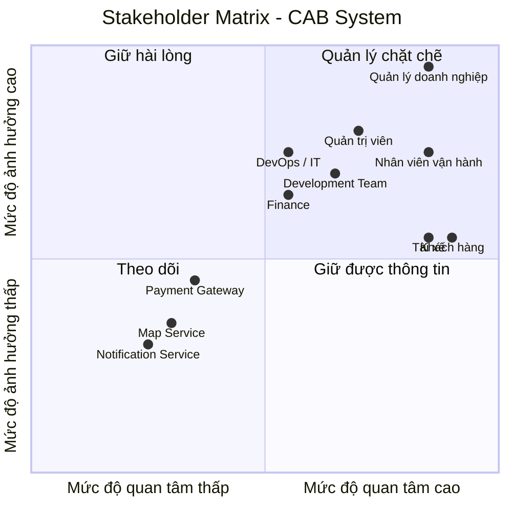
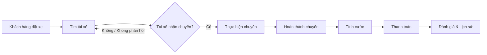
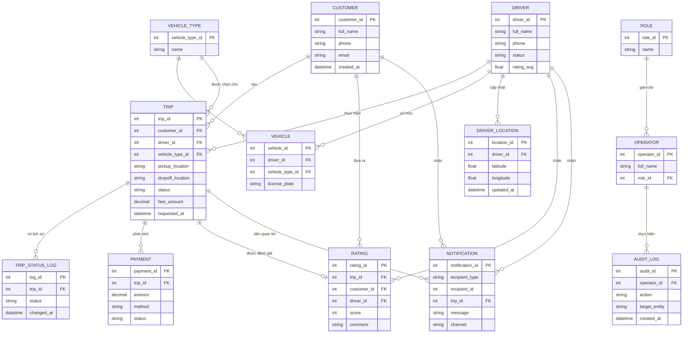
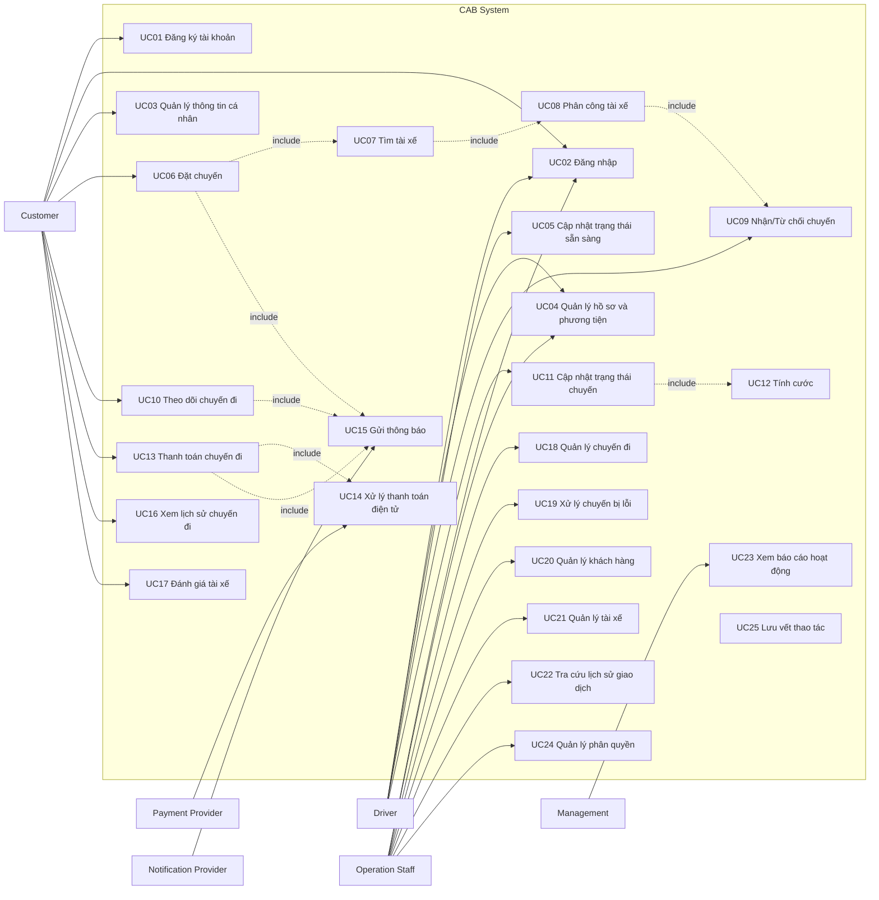

### Xây dựng hệ thống cơ bản

**Đóng vai trò:** BA (Business Analyst)

#### Bước 1: Phân tích yêu cầu của khách hàng

Ở giai đoạn sơ khởi (giai đoạn 1), BA cần tập trung vào việc **phân tích và tìm hiểu yêu cầu của khách hàng**.

Mục tiêu chính là hiểu được **Business Context** – tức là **ngữ cảnh của nghiệp vụ**, bao gồm:

- **Khách hàng là ai?**
- **Doanh nghiệp đang giải quyết vấn đề gì?**
- **Mục tiêu kinh doanh (Business Goal) là gì?**
- **Quy trình nghiệp vụ hiện tại (As-Is) đang diễn ra như thế nào?**
- **Những vấn đề hoặc khó khăn đang tồn tại là gì?**
- **Hệ thống cần giải quyết vấn đề nào?**
- **Kết quả mong muốn (To-Be) của khách hàng là gì?**
**Trả lời cho dự án CAB System:**

- **Khách hàng là ai?** Công ty ABC – doanh nghiệp cung cấp dịch vụ đặt xe trực tuyến.
- **Doanh nghiệp đang giải quyết vấn đề gì?** Hệ thống hiện tại (tổng đài + app đơn giản) còn nhiều hạn chế: phân công tài xế thủ công, khách hàng khó theo dõi trạng thái chuyến đi, thông tin thanh toán chưa quản lý tập trung, khó mở rộng hệ thống khi quy mô tăng.
- **Mục tiêu kinh doanh (Business Goal) là gì?** Xây dựng một nền tảng CAB mới có khả năng phục vụ số lượng lớn khách hàng và tài xế, đồng thời có thể phát triển thêm tính năng trong tương lai mà không cần xây lại toàn bộ hệ thống.
- **Quy trình nghiệp vụ hiện tại (As-Is) đang diễn ra như thế nào?** Khách hàng liên hệ tổng đài hoặc dùng app đơn giản để yêu cầu xe → nhân viên phân công tài xế thủ công → khách hàng khó nắm được trạng thái chuyến → thanh toán và dữ liệu chưa tập trung, khó theo dõi.
- **Những vấn đề hoặc khó khăn đang tồn tại là gì?**
  - Phân công tài xế thủ công, chậm, không tối ưu.
  - Thiếu minh bạch về trạng thái chuyến đi cho khách hàng.
  - Thanh toán phân mảnh, chưa tích hợp cổng thanh toán bên ngoài an toàn.
  - Khó mở rộng hạ tầng khi tải tăng cao (giờ cao điểm).
  - Thiếu công cụ quản trị & báo cáo cho vận hành.
  - Chưa có kiểm soát bảo mật, phân quyền và audit trail rõ ràng.
- **Hệ thống cần giải quyết vấn đề nào?** Tự động hóa việc tìm và phân công tài xế, tập trung hóa quản lý thanh toán, cung cấp khả năng theo dõi chuyến đi theo thời gian thực, đảm bảo hệ thống có thể mở rộng độc lập theo module (kiến trúc modular/microservices) và không bị sập toàn bộ khi một thành phần (thanh toán, thông báo) gặp lỗi.
- **Kết quả mong muốn (To-Be) của khách hàng là gì?** Một nền tảng CAB hoàn chỉnh, đáp ứng toàn bộ quy trình từ tạo yêu cầu → tìm/phân công tài xế → thực hiện chuyến → tính cước → thanh toán → thông báo → đánh giá sau chuyến, có khả năng mở rộng linh hoạt (thêm dịch vụ, phương thức thanh toán, kênh thông báo) và đảm bảo bảo mật, ổn định khi vận hành ở quy mô lớn.
  
## 2. Xác định các Stakeholders

### 2.1. Danh sách Stakeholders

| Tên Stakeholders | Vai trò |
|---|---|
| **Khách hàng (Customer)** | Người sử dụng hệ thống để đặt xe, theo dõi chuyến đi, thanh toán và đánh giá dịch vụ. |
| **Tài xế (Driver)** | Nhận yêu cầu chuyến xe, xác nhận chuyến, thực hiện chuyến và cập nhật trạng thái chuyến đi. |
| **Nhân viên vận hành (Operator)** | Theo dõi và điều phối hoạt động đặt xe, hỗ trợ xử lý các vấn đề phát sinh trong quá trình vận hành. |
| **Quản trị viên (Admin)** | Quản lý người dùng, tài xế, phân quyền, cấu hình hệ thống và theo dõi hoạt động của hệ thống. |
| **Quản lý doanh nghiệp (Business Manager)** | Định hướng mục tiêu kinh doanh, theo dõi hiệu quả hoạt động và đưa ra các quyết định liên quan đến hệ thống. |
| **Bộ phận kế toán / tài chính (Finance)** | Quản lý doanh thu, giao dịch, đối soát và các vấn đề liên quan đến thanh toán. |
| **Đội ngũ phát triển (Development Team)** | Phân tích, thiết kế, phát triển, tích hợp và bảo trì hệ thống. |
| **Đội ngũ vận hành hệ thống (DevOps / IT Operations)** | Triển khai, giám sát, đảm bảo tính ổn định, khả năng mở rộng và xử lý sự cố hệ thống. |
| **Cổng thanh toán (Payment Gateway)** | Cung cấp dịch vụ xử lý và xác nhận các giao dịch thanh toán. |
| **Dịch vụ bản đồ / định vị (Map & Location Service)** | Cung cấp dữ liệu bản đồ, vị trí, khoảng cách và hỗ trợ tính toán lộ trình. |
| **Dịch vụ thông báo (Notification Service)** | Gửi thông báo đến khách hàng và tài xế thông qua các kênh như SMS, Email hoặc Push Notification. |

### 2.2. Stakeholder Matrix

Stakeholder Matrix giúp xác định **mức độ ảnh hưởng (Power)** và **mức độ quan tâm (Interest)** của từng stakeholder đối với hệ thống.

**Diễn giải 4 nhóm trong ma trận:**

- **Quản lý chặt chẽ (High Power – High Interest):** Ban lãnh đạo, BA → cần giao tiếp thường xuyên, tham gia sâu vào các quyết định.
- **Giữ hài lòng (High Power – Low Interest):** Nhân viên vận hành, Bộ phận bảo mật → cần được thông báo và đảm bảo yêu cầu của họ được đáp ứng dù không tham gia hàng ngày.
- **Giữ thông tin đầy đủ (Low Power – High Interest):** Khách hàng, Tài xế, Đội phát triển → quan tâm trực tiếp đến kết quả, cần được cập nhật thông tin thường xuyên nhưng không có quyền quyết định phạm vi dự án.
- **Giám sát tối thiểu (Low Power – Low Interest):** Nhà cung cấp thanh toán bên ngoài → chỉ cần phối hợp ở mức tích hợp kỹ thuật, không cần tham gia sâu vào quá trình phân tích.
.....

#### Bước 3: Xác định Mục tiêu nghiệp vụ (Business Goals)

Từ Business Context và Business Purpose đã phân tích ở Bước 1, BA xác định các mục tiêu nghiệp vụ cụ thể mà hệ thống CAB cần đạt được:

| Mã | Mục tiêu nghiệp vụ (Business Goal) |
|---|---|
| BG01 | Tự động tìm và phân công tài xế phù hợp cho khách hàng |
| BG02 | Hỗ trợ thanh toán (cho phép thanh toán tiền mặt và thanh toán điện tử) |
| BG03 | Cung cấp khả năng theo dõi chuyến đi theo thời gian thực cho khách hàng |
| BG04 | Gửi thông báo tự động cho khách hàng và tài xế xuyên suốt vòng đời chuyến đi |
| BG05 | Cung cấp công cụ quản trị và báo cáo cho nhân viên vận hành |
| BG06 | Đảm bảo hệ thống có khả năng mở rộng (scalable) và hoạt động ổn định khi tải tăng cao |
| BG07 | Bảo vệ dữ liệu và kiểm soát truy cập theo đúng yêu cầu bảo mật |
| BG08 | Xây dựng kiến trúc linh hoạt, dễ mở rộng để bổ sung dịch vụ, phương thức thanh toán, kênh thông báo mới trong tương lai |
| BG09 | Nâng cao chất lượng dịch vụ thông qua cơ chế đánh giá tài xế sau chuyến đi |

**Diễn giải chi tiết:**

- **BG01 – Tự động tìm tài xế:** Khi khách hàng tạo chuyến, hệ thống tự động xác định tài xế phù hợp dựa trên vị trí, trạng thái sẵn sàng và tiêu chí vận hành, có cơ chế tìm tài xế khác nếu tài xế đầu tiên không phản hồi/từ chối, không yêu cầu khách hàng tạo lại yêu cầu.
- **BG02 – Hỗ trợ thanh toán:** Cho phép thanh toán tiền mặt và thanh toán điện tử qua nhà cung cấp thanh toán bên ngoài, không lưu trực tiếp thông tin nhạy cảm của thẻ/tài khoản trong hệ thống CAB, có cơ chế xử lý khi giao dịch điện tử thất bại.
- **BG03 – Theo dõi chuyến đi thời gian thực:** Khách hàng biết được trạng thái tìm tài xế, tài xế nhận chuyến, thời gian dự kiến đến và trạng thái hiện tại của chuyến đi.
- **BG04 – Thông báo:** Khách hàng nhận thông báo khi yêu cầu được tiếp nhận, tài xế nhận chuyến, tài xế đến điểm đón, chuyến hoàn thành, kết quả thanh toán; tài xế nhận thông báo về chuyến mới hoặc thay đổi liên quan.
- **BG05 – Công cụ quản trị & báo cáo:** Nhân viên vận hành quản lý khách hàng, tài xế, phương tiện, chuyến đi; xem báo cáo số lượng chuyến, doanh thu, tỷ lệ hoàn thành/hủy, hiệu quả hoạt động tài xế.
- **BG06 – Khả năng mở rộng & ổn định:** Các thành phần hệ thống scale độc lập khi tải tăng; lỗi ở một chức năng (thanh toán, thông báo) không làm sập toàn bộ hệ thống.
- **BG07 – Bảo mật:** Xác thực khách hàng/tài xế trước khi dùng chức năng yêu cầu tài khoản, kiểm soát quyền truy cập cho thao tác quản trị, bảo vệ dữ liệu cá nhân/vị trí/giao dịch, lưu vết (audit log) các thao tác quan trọng.
- **BG08 – Kiến trúc linh hoạt:** Cho phép bổ sung loại dịch vụ mới, phương thức thanh toán mới, nhà cung cấp thông báo mới hoặc thay đổi thành phần kỹ thuật mà không cần xây lại toàn bộ ứng dụng.
- **BG09 – Đánh giá tài xế:** Sau khi hoàn thành chuyến, khách hàng có thể đánh giá tài xế; dữ liệu đánh giá được dùng để cải thiện chất lượng dịch vụ và làm tiêu chí tham khảo trong hoạt động vận hành (ví dụ: theo dõi hiệu quả tài xế trong báo cáo — liên quan BG05).

# 4. Xác định phạm vi yêu cầu của mình phải làm(Scope) 
# - VD: Quản lý khách hàng, Quản lý tài xế,...
# - Trong bảng MVP phải làm cái gì - Xác định được các module cơ bản dưới góc độ 1 bảng MVP 
# - Mở rộng: Những cái mà ngoài phạm vi tôi không phải làm/Không nên làm trong đây

## 4.1. In Scope – Phạm vi hệ thống

Dựa trên yêu cầu của khách hàng, phạm vi của CAB System bao gồm các module nghiệp vụ chính sau:

| ID      | Module                           | Phạm vi chính                                                                                                                                           |
| ------- | -------------------------------- | ------------------------------------------------------------------------------------------------------------------------------------------------------- |
| **M01** | **Quản lý tài khoản & xác thực** | Đăng ký, đăng nhập, xác thực khách hàng và tài xế, cập nhật thông tin cá nhân và kiểm soát quyền truy cập.                                              |
| **M02** | **Quản lý tài xế & phương tiện** | Quản lý hồ sơ tài xế, thông tin phương tiện, trạng thái hoạt động và thông tin vị trí của tài xế.                                                       |
| **M03** | **Đặt xe**                       | Nhập điểm đón, điểm đến, lựa chọn loại xe và tạo yêu cầu đặt xe.                                                                                        |
| **M04** | **Tìm kiếm & phân công tài xế**  | Xác định tài xế phù hợp, ưu tiên tài xế gần khách hàng, gửi yêu cầu nhận chuyến và xử lý trường hợp tài xế từ chối hoặc không phản hồi.                 |
| **M05** | **Quản lý chuyến đi**            | Theo dõi và cập nhật các trạng thái của chuyến: tìm tài xế, tài xế nhận chuyến, tài xế đến điểm đón, đã đón khách, đang di chuyển và hoàn thành chuyến. |
| **M06** | **Tính cước & thanh toán**       | Tính số tiền phải trả, hỗ trợ thanh toán tiền mặt và thanh toán điện tử thông qua Payment Provider, xử lý kết quả giao dịch và thanh toán thất bại.     |
| **M07** | **Thông báo**                    | Gửi thông báo cho khách hàng và tài xế về các sự kiện liên quan đến đặt xe, tài xế, chuyến đi và thanh toán.                                            |
| **M08** | **Lịch sử & đánh giá**           | Xem lịch sử chuyến đi, số tiền phải trả và đánh giá tài xế sau khi hoàn thành chuyến.                                                                   |
| **M09** | **Quản trị & vận hành**          | Quản lý khách hàng, tài xế, phương tiện và chuyến đi; theo dõi chuyến đang diễn ra, trạng thái tài xế và hỗ trợ xử lý sự cố.                            |
| **M10** | **Báo cáo**                      | Cung cấp báo cáo về số lượng chuyến, doanh thu, tỷ lệ hoàn thành, tỷ lệ hủy và hiệu quả hoạt động của tài xế.                                           |
| **M11** | **Bảo mật & Audit Log**          | Xác thực, phân quyền các thao tác quản trị, bảo vệ dữ liệu cá nhân, phương tiện, vị trí và giao dịch; lưu vết các thao tác quan trọng.                  |
| **M12** | **Tích hợp hệ thống bên ngoài**  | Tích hợp với nhà cung cấp thanh toán và nhà cung cấp dịch vụ thông báo.                                                                                 |

---

## 4.2. MVP – Minimum Viable Product

Do thời gian xây dựng và triển khai sản phẩm chỉ **7 tuần**, MVP tập trung vào quy trình nghiệp vụ cốt lõi từ **đặt xe → tìm tài xế → thực hiện chuyến → tính cước → thanh toán**.

| Priority        | Module                              | MVP cần thực hiện                                                                          |
| --------------- | ----------------------------------- | ------------------------------------------------------------------------------------------ |
| **Must Have**   | **M01 – Tài khoản & xác thực**      | Đăng ký, đăng nhập và xác thực khách hàng/tài xế.                                          |
| **Must Have**   | **M02 – Tài xế & phương tiện**      | Quản lý hồ sơ, phương tiện và trạng thái sẵn sàng của tài xế.                              |
| **Must Have**   | **M03 – Đặt xe**                    | Nhập điểm đón, điểm đến, chọn loại xe và gửi yêu cầu đặt xe.                               |
| **Must Have**   | **M04 – Tìm & phân công tài xế**    | Tìm tài xế phù hợp, gửi yêu cầu, xử lý từ chối/không phản hồi và tiếp tục tìm tài xế khác. |
| **Must Have**   | **M05 – Quản lý chuyến**            | Cập nhật và theo dõi trạng thái chuyến từ lúc đặt xe đến khi hoàn thành.                   |
| **Must Have**   | **M06 – Tính cước & thanh toán**    | Tính cước, thanh toán tiền mặt và tích hợp thanh toán điện tử.                             |
| **Must Have**   | **M07 – Thông báo**                 | Các thông báo thiết yếu cho khách hàng và tài xế.                                          |
| **Must Have**   | **M09 – Quản trị & vận hành**       | Theo dõi chuyến, trạng thái tài xế và xử lý các trường hợp phát sinh cơ bản.               |
| **Must Have**   | **M11 – Bảo mật & Audit Log**       | Xác thực, phân quyền và bảo vệ dữ liệu quan trọng.                                         |
| **Should Have** | **M08 – Lịch sử & đánh giá**        | Xem lịch sử chuyến và đánh giá tài xế sau chuyến.                                          |
| **Should Have** | **M10 – Báo cáo**                   | Các báo cáo cơ bản về chuyến, doanh thu, hoàn thành và hủy chuyến.                         |
| **Should Have** | **M12 – Khả năng mở rộng tích hợp** | Thiết kế khả năng thay đổi/thêm Payment Provider và Notification Provider trong tương lai. |

### MVP Core Flow

---

## 4.3. Out of Scope – Ngoài phạm vi

Các chức năng sau **không được đề cập trong yêu cầu hiện tại** và không đưa vào phạm vi xây dựng MVP:

| ID      | Hạng mục                                                     | Lý do                                                                                        |
| ------- | ------------------------------------------------------------ | -------------------------------------------------------------------------------------------- |
| **O01** | Chương trình tích điểm / Loyalty                             | Không được đề cập trong yêu cầu khách hàng.                                                  |
| **O02** | Mã giảm giá / Voucher / Coupon                               | Không được đề cập trong yêu cầu hiện tại.                                                    |
| **O03** | Gói thành viên / Subscription                                | Không thuộc quy trình đặt xe được mô tả.                                                     |
| **O04** | Đặt xe định kỳ                                               | Không được đề cập trong yêu cầu.                                                             |
| **O05** | Dịch vụ giao hàng                                            | Chưa có yêu cầu về loại dịch vụ này.                                                         |
| **O06** | Quảng cáo hoặc bán dịch vụ bên thứ ba                        | Không thuộc mục tiêu của dự án.                                                              |
| **O07** | Hệ thống thưởng/phạt tài xế nâng cao                         | Transcript chỉ yêu cầu quản lý và đánh giá hiệu quả tài xế, chưa yêu cầu cơ chế thưởng/phạt. |
| **O08** | Phân tích dữ liệu nâng cao / AI dự đoán                      | Không được yêu cầu trong phạm vi hiện tại.                                                   |
| **O09** | Ứng dụng riêng cho bộ phận quản trị ngoài giao diện quản trị | Chưa có yêu cầu xây dựng ứng dụng riêng; hệ thống chỉ yêu cầu giao diện quản trị.            |

---

## 4.4. Future Scope – Khả năng mở rộng trong tương lai

Hệ thống được định hướng có khả năng mở rộng, do đó các hạng mục sau có thể được xem xét ở các giai đoạn tiếp theo:

* Bổ sung các loại dịch vụ/loại hình đặt xe mới.
* Bổ sung các phương thức thanh toán mới.
* Bổ sung nhà cung cấp thanh toán hoặc thông báo.
* Mở rộng các kênh thông báo.
* Mở rộng chức năng báo cáo và phân tích.
* Bổ sung các chức năng nghiệp vụ mới theo nhu cầu kinh doanh.
* Thay đổi hoặc nâng cấp các thành phần kỹ thuật mà hạn chế ảnh hưởng đến các chức năng đang hoạt động.

# 5: Xác nhận với khách hàng & Chuyển thành Business Requirement (BR)

**Dự án:** CAB System – Nền tảng đặt xe
**Vai trò:** Business Analyst (BA)

---

## 1. Mục đích bước này

Sau khi hoàn thành **Bước 4** (thu thập & đặc tả yêu cầu chức năng/phi chức năng chi tiết, làm rõ các điểm còn mơ hồ với stakeholder), BA cần:

1. Tổ chức buổi họp xác nhận lại với khách hàng để đảm bảo hiểu đúng yêu cầu.
2. Sau khi khách hàng xác nhận, chuyển hóa các yêu cầu đó thành **Business Requirement (BR)** — mô tả *doanh nghiệp cần gì* (ở mức nghiệp vụ), làm nền tảng để sau này BA tiếp tục phân rã thành Functional Requirement (FR) chi tiết hơn.

Mỗi BR được đặt mã theo quy tắc: **BR + số thứ tự 2 chữ số** (BR01, BR02, BR03...).

---

## 2. Danh sách Business Requirement (BR)

| Mã | Tên | Diễn giải |
|---|---|---|
| **BR01** | Đặt chuyến | Khách hàng có thể tạo yêu cầu đặt xe bằng cách nhập điểm đón, điểm đến và chọn loại xe; hệ thống tiếp nhận và bắt đầu quy trình tìm tài xế. |
| **BR02** | Quản lý tài khoản khách hàng | Khách hàng có thể đăng ký, đăng nhập và cập nhật thông tin cá nhân để sử dụng dịch vụ. |
| **BR03** | Quản lý tài khoản & hồ sơ tài xế | Tài xế được đăng ký (tự đăng ký hoặc do nhân viên vận hành tạo) và có thể cập nhật hồ sơ, thông tin phương tiện, trạng thái hoạt động. |
| **BR04** | Tìm kiếm & phân công tài xế | Hệ thống tự động xác định và đề xuất tài xế phù hợp cho một chuyến đi, dựa trên vị trí, trạng thái sẵn sàng và tiêu chí vận hành. |
| **BR05** | Xử lý từ chối/không phản hồi của tài xế | Khi tài xế được đề xuất không nhận chuyến, hệ thống tự động tìm tài xế khác mà không yêu cầu khách hàng tạo lại yêu cầu; nếu không tìm được, khách hàng phải được thông báo rõ ràng. |
| **BR06** | Theo dõi trạng thái chuyến đi | Khách hàng và tài xế có thể theo dõi/cập nhật trạng thái chuyến đi theo thời gian thực (đang tìm tài xế, đã nhận chuyến, đã đến điểm đón, đang di chuyển, hoàn thành...). |
| **BR07** | Cập nhật vị trí tài xế | Hệ thống lưu và cập nhật vị trí tài xế để hỗ trợ việc tìm tài xế gần khách hàng và ước tính thời gian đến. |
| **BR08** | Tính cước chuyến đi | Sau khi chuyến đi hoàn thành, hệ thống tự động xác định số tiền khách hàng phải trả dựa trên loại dịch vụ và thông tin chuyến đi. |
| **BR09** | Thanh toán | Khách hàng có thể thanh toán bằng tiền mặt hoặc phương thức điện tử; hệ thống tích hợp với nhà cung cấp thanh toán bên ngoài mà không lưu trực tiếp thông tin nhạy cảm của thẻ/tài khoản. |
| **BR10** | Xử lý lỗi thanh toán | Khi giao dịch thanh toán điện tử thất bại, hệ thống thông báo cho khách hàng và cho phép xử lý lại theo chính sách doanh nghiệp. |
| **BR11** | Lịch sử chuyến & đánh giá tài xế | Khách hàng có thể xem lịch sử chuyến đi, số tiền đã trả và đánh giá tài xế sau khi hoàn thành chuyến. |
| **BR12** | Thông báo cho khách hàng | Khách hàng nhận thông báo tại các mốc quan trọng: yêu cầu được tiếp nhận, tài xế nhận chuyến, tài xế đến điểm đón, chuyến hoàn thành, kết quả thanh toán. |
| **BR13** | Thông báo cho tài xế | Tài xế nhận thông báo về chuyến mới hoặc thay đổi liên quan đến chuyến đang thực hiện. |
| **BR14** | Quản trị vận hành | Nhân viên vận hành có giao diện quản trị để quản lý khách hàng, tài xế, phương tiện và chuyến đi, bao gồm xử lý các chuyến bị lỗi và tra cứu lịch sử giao dịch. |
| **BR15** | Phân quyền thao tác quản trị | Các thao tác quản trị nhạy cảm phải được phân quyền, nhân viên thông thường không thể thực hiện. |
| **BR16** | Báo cáo & thống kê vận hành | Ban lãnh đạo có báo cáo về số lượng chuyến, doanh thu, tỷ lệ chuyến hoàn thành, tỷ lệ hủy và hiệu quả hoạt động của tài xế. |
| **BR17** | Xác thực người dùng | Khách hàng và tài xế phải được xác thực trước khi sử dụng các chức năng yêu cầu tài khoản. |
| **BR18** | Bảo vệ dữ liệu | Thông tin cá nhân, thông tin phương tiện, dữ liệu vị trí và dữ liệu giao dịch phải được bảo vệ. |
| **BR19** | Lưu vết thao tác (Audit log) | Hệ thống lưu vết các thao tác quan trọng để phục vụ kiểm tra khi có sự cố. |
| **BR20** | Vận hành ổn định & chịu lỗi cục bộ | Hệ thống phải hoạt động ổn định vào thời điểm nhu cầu cao; lỗi ở một chức năng (thanh toán, thông báo...) không được làm ngừng toàn bộ hệ thống đặt xe. |
| **BR21** | Kiến trúc mở rộng linh hoạt | Hệ thống phải có khả năng mở rộng độc lập theo tải, triển khai từng phần và bổ sung dịch vụ mới, phương thức thanh toán mới, kênh thông báo mới mà không cần xây dựng lại toàn bộ. |

---
# 6: Xây dựng Business Process (Quy trình nghiệp vụ)

Từ danh sách Business Requirements (BR01–BR37) đã xác nhận với khách hàng ở Bước 5, tiến hành mô hình hóa thành các **Business Process (BP)** — mô tả luồng thực hiện từng bước, bao gồm cả **luồng chính (Main Flow)**, **luồng phụ (Alternative Flow)** và **luồng ngoại lệ (Exception Flow)**. Mỗi BP là cơ sở để thiết kế Use Case chi tiết ở bước sau.

---

##### BP01 – Đặt chuyến (Booking Trip)

**Mục tiêu:** Khách hàng tạo yêu cầu đặt xe và được ghép với tài xế phù hợp.
**BR liên quan:** BR11, BR12, BR13, BR14, BR15, BR16

**Luồng chính (Main Flow):**
1. Khách hàng đăng nhập vào hệ thống.
2. Khách hàng nhập điểm đón và điểm đến.
3. Khách hàng chọn loại xe/dịch vụ.
4. Khách hàng xác nhận gửi yêu cầu đặt xe.
5. Hệ thống tiếp nhận yêu cầu và gửi thông báo xác nhận cho khách hàng.
6. Hệ thống tìm kiếm tài xế phù hợp dựa trên vị trí và trạng thái sẵn sàng (→ BP02).
7. Tài xế chấp nhận chuyến.
8. Hệ thống thông báo cho khách hàng: tài xế đã nhận chuyến, thông tin tài xế, thời gian dự kiến đến.
9. Chuyến đi chuyển sang trạng thái "đang chờ tài xế đến điểm đón" (→ BP03).

**Luồng phụ (Alternative Flow):**
- 7a. Tài xế từ chối hoặc không phản hồi trong thời gian quy định → hệ thống tự động tìm tài xế kế tiếp (lặp lại bước 6–7), khách hàng **không cần** tạo lại yêu cầu.

**Luồng ngoại lệ (Exception Flow):**
- 6a. Không tìm được tài xế phù hợp sau nhiều lần thử → hệ thống thông báo rõ cho khách hàng là không tìm được tài xế, kết thúc quy trình.
- 4a. Khách hàng hủy yêu cầu trước khi có tài xế nhận → hệ thống hủy yêu cầu, không phát sinh chi phí.

---

##### BP02 – Điều phối & Tìm tài xế (Dispatch/Matching)

**Mục tiêu:** Ghép tài xế phù hợp nhất cho một yêu cầu đặt xe.
**BR liên quan:** BR12, BR13, BR14, BR15

**Luồng chính:**
1. Hệ thống nhận yêu cầu đặt xe từ BP01.
2. Hệ thống xác định danh sách tài xế đang ở trạng thái sẵn sàng, gần vị trí khách hàng.
3. Hệ thống chọn tài xế phù hợp nhất theo tiêu chí ưu tiên (khoảng cách, trạng thái...).
4. Hệ thống gửi thông báo đề xuất chuyến đến tài xế được chọn.
5. Tài xế phản hồi (chấp nhận/từ chối) trong thời gian quy định.
6. Nếu chấp nhận → hệ thống cập nhật trạng thái chuyến là "đã có tài xế", kết thúc quy trình, quay lại BP01 bước 8.

**Luồng phụ:**
- 5a. Tài xế từ chối → hệ thống loại tài xế này khỏi danh sách đề xuất cho chuyến hiện tại, quay lại bước 3 với tài xế kế tiếp.
- 5b. Tài xế không phản hồi trong thời gian quy định (timeout) → hệ thống tự động loại và quay lại bước 3.

**Luồng ngoại lệ:**
- 2a. Không còn tài xế nào sẵn sàng trong khu vực → chuyển sang BP01 – Exception (thông báo không tìm được tài xế).

---

##### BP03 – Thực hiện chuyến đi (Trip Execution)

**Mục tiêu:** Theo dõi và cập nhật hành trình chuyến đi từ khi tài xế nhận cho đến khi hoàn thành.
**BR liên quan:** BR16, BR17

**Luồng chính:**
1. Tài xế di chuyển đến điểm đón.
2. Tài xế cập nhật trạng thái "đã đến điểm đón".
3. Hệ thống thông báo cho khách hàng tài xế đã đến.
4. Tài xế cập nhật trạng thái "đã đón khách".
5. Tài xế cập nhật trạng thái "đang di chuyển".
6. Khách hàng theo dõi hành trình theo thời gian thực trong suốt chuyến đi.
7. Tài xế đến điểm trả khách, cập nhật trạng thái "hoàn thành chuyến".
8. Hệ thống chuyển sang quy trình tính cước và thanh toán (→ BP04).

**Luồng phụ:**
- 1a. Khách hàng hủy chuyến sau khi đã có tài xế nhưng trước khi tài xế đến điểm đón → hệ thống cập nhật trạng thái "đã hủy", giải phóng tài xế về trạng thái sẵn sàng (chính sách phí hủy: cần làm rõ thêm với khách hàng — xem Open Questions).

**Luồng ngoại lệ:**
- 4a. Khách hàng không có mặt tại điểm đón → cần quy trình xử lý riêng (chính sách chưa chốt — Open Question), tạm thời chuyển cho nhân viên vận hành xử lý thủ công (→ BP08).
- 5a. Mất kết nối giữa app tài xế và hệ thống trong khi di chuyển → cần cơ chế đồng bộ lại trạng thái khi có kết nối trở lại (chi tiết kỹ thuật xử lý mất kết nối chưa chốt — Open Question).

---

##### BP04 – Tính cước & Thanh toán (Fare & Payment)

**Mục tiêu:** Xác định số tiền khách hàng phải trả và xử lý thanh toán sau khi hoàn thành chuyến.
**BR liên quan:** BR18, BR19, BR20, BR21, BR22

**Luồng chính:**
1. Hệ thống nhận sự kiện "chuyến hoàn thành" từ BP03.
2. Hệ thống tính cước dựa trên loại dịch vụ và thông tin chuyến đi.
3. Hệ thống hiển thị số tiền cần thanh toán cho khách hàng.
4. Khách hàng chọn hình thức thanh toán: tiền mặt hoặc điện tử.

**Nhánh 4a – Thanh toán tiền mặt:**
- 4a.1. Khách hàng trả tiền mặt trực tiếp cho tài xế.
- 4a.2. Tài xế xác nhận đã nhận tiền trên hệ thống.
- 4a.3. Hệ thống cập nhật trạng thái thanh toán "hoàn tất".
**Nhánh 4b – Thanh toán điện tử:**
- 4b.1. Hệ thống gửi yêu cầu thanh toán đến nhà cung cấp thanh toán bên ngoài (không gửi kèm thông tin nhạy cảm của thẻ/tài khoản đến hệ thống CAB).
- 4b.2. Nhà cung cấp thanh toán xử lý và trả kết quả về hệ thống.
- 4b.3. Hệ thống cập nhật trạng thái thanh toán "hoàn tất" và thông báo kết quả cho khách hàng (→ BP05).

**Luồng ngoại lệ:**
- 4b.2a. Giao dịch thanh toán điện tử thất bại → hệ thống thông báo cho khách hàng, cho phép chọn lại phương thức thanh toán hoặc thử lại theo chính sách của doanh nghiệp (chi tiết chính sách retry chưa chốt — Open Question).

---

##### BP05 – Thông báo (Notification)

**Mục tiêu:** Đảm bảo khách hàng và tài xế được cập nhật thông tin kịp thời tại các mốc quan trọng.
**BR liên quan:** BR23, BR24

**Luồng chính (chạy song song/độc lập với các BP khác, được kích hoạt bởi sự kiện):**
1. Hệ thống lắng nghe các sự kiện phát sinh từ các quy trình khác: tiếp nhận yêu cầu (BP01), tài xế nhận chuyến (BP02), tài xế đến điểm đón / hoàn thành chuyến (BP03), kết quả thanh toán (BP04).
2. Khi có sự kiện phát sinh, hệ thống xác định đối tượng cần nhận thông báo (khách hàng và/hoặc tài xế).
3. Hệ thống gửi thông báo qua kênh tương ứng (ví dụ: push notification/app).
4. Ghi nhận trạng thái gửi thông báo (thành công/thất bại).

**Luồng ngoại lệ:**
- 3a. Gửi thông báo thất bại → hệ thống ghi log lỗi, có thể thử gửi lại theo chính sách (không được ảnh hưởng đến các chức năng đặt xe/thanh toán khác — theo BR36).

---

##### BP06 – Đánh giá tài xế (Rating)

**Mục tiêu:** Thu thập phản hồi của khách hàng sau chuyến đi.
**BR liên quan:** BR25

**Luồng chính:**
1. Sau khi thanh toán hoàn tất (BP04), hệ thống hiển thị màn hình đánh giá cho khách hàng.
2. Khách hàng chọn mức đánh giá (ví dụ số sao) và có thể để lại nhận xét.
3. Khách hàng xác nhận gửi đánh giá.
4. Hệ thống lưu đánh giá, cập nhật điểm trung bình của tài xế.

**Luồng phụ:**
- 2a. Khách hàng bỏ qua bước đánh giá → hệ thống không ghi nhận đánh giá cho chuyến này, kết thúc quy trình.

---

##### BP07 – Đăng ký & Xác thực tài khoản (Registration & Authentication)

**Mục tiêu:** Cho phép khách hàng/tài xế tạo tài khoản và đăng nhập an toàn vào hệ thống.
**BR liên quan:** BR01, BR02, BR03, BR04

**Luồng chính:**
1. Người dùng (khách hàng/tài xế) chọn chức năng đăng ký.
2. Người dùng nhập thông tin cá nhân bắt buộc.
3. Hệ thống xác thực thông tin (ví dụ số điện thoại/email) hợp lệ.
4. Hệ thống tạo tài khoản mới.
5. Người dùng đăng nhập bằng tài khoản vừa tạo.
6. Hệ thống xác thực và cấp quyền truy cập tương ứng với vai trò (khách hàng/tài xế/nhân viên vận hành).

**Luồng phụ:**
- 2a. Đối với tài xế: nhân viên vận hành có thể tạo tài khoản thay tài xế (không qua bước tự đăng ký).

**Luồng ngoại lệ:**
- 3a. Thông tin không hợp lệ hoặc đã tồn tại → hệ thống thông báo lỗi, yêu cầu người dùng nhập lại.
- 6a. Sai thông tin đăng nhập → hệ thống từ chối truy cập và thông báo lỗi.

---

##### BP08 – Quản trị & Xử lý sự cố chuyến đi (Admin Operations)

**Mục tiêu:** Hỗ trợ nhân viên vận hành giám sát và xử lý các chuyến đi gặp vấn đề.
**BR liên quan:** BR26, BR27, BR28, BR29, BR30, BR35

**Luồng chính:**
1. Nhân viên vận hành đăng nhập vào giao diện quản trị.
2. Nhân viên xem danh sách các chuyến đang diễn ra và trạng thái tương ứng.
3. Nhân viên phát hiện hoặc được báo cáo một chuyến gặp sự cố (ví dụ khách không có mặt, tài xế mất kết nối...).
4. Nhân viên tra cứu thông tin chi tiết chuyến, khách hàng, tài xế liên quan.
5. Nhân viên thực hiện thao tác xử lý phù hợp (ví dụ: hủy chuyến, ghép lại tài xế, ghi chú sự cố).
6. Hệ thống ghi log thao tác xử lý (audit log).

**Luồng ngoại lệ:**
- 5a. Thao tác thuộc nhóm nhạy cảm (ví dụ hoàn tiền, khóa tài khoản) → hệ thống kiểm tra quyền hạn; nếu nhân viên không đủ quyền, từ chối thao tác và yêu cầu chuyển cấp quản trị cao hơn (theo BR04).

---

##### BP09 – Báo cáo vận hành (Reporting)

**Mục tiêu:** Cung cấp số liệu tổng hợp phục vụ ra quyết định quản lý.
**BR liên quan:** BR31, BR32, BR33

**Luồng chính:**
1. Nhân viên vận hành/quản lý chọn loại báo cáo cần xem (số lượng chuyến & doanh thu, tỷ lệ hoàn thành/hủy, hiệu quả tài xế).
2. Nhân viên chọn khoảng thời gian cần thống kê.
3. Hệ thống tổng hợp dữ liệu từ các chuyến đi, thanh toán, đánh giá tương ứng trong khoảng thời gian đã chọn.
4. Hệ thống hiển thị báo cáo dưới dạng bảng/biểu đồ.

**Luồng ngoại lệ:**
- 3a. Không có dữ liệu trong khoảng thời gian được chọn → hệ thống hiển thị thông báo "không có dữ liệu", không báo lỗi hệ thống.

---

##### Ghi chú tổng hợp

- Toàn bộ 9 Business Process (BP01–BP09) trên bao phủ đầy đủ các nhóm BR đã liệt kê ở Bước 5, tương ứng với các module đã xác định ở Bước 4.
- Các bước có đánh dấu **"chưa chốt" / "Open Question"** (ví dụ: chính sách hủy chuyến, xử lý khách không có mặt, xử lý mất kết nối mạng, chính sách retry thanh toán) cần được BA làm rõ với khách hàng **trước khi chuyển sang thiết kế Use Case chi tiết và đặc tả chức năng (Bước 7)**.
- Các BP được thiết kế tuân theo nguyên tắc **tách rời và không phụ thuộc chặt (loose coupling)** giữa các phân hệ (ví dụ: lỗi ở BP05 - Thông báo không được làm gián đoạn BP01 - Đặt chuyến), đúng theo yêu cầu BG06/BR36 về khả năng vận hành ổn định.

- Bảng trên là **Business Requirement** (mức nghiệp vụ – "cần cái gì, để làm gì"), **chưa** đi vào chi tiết kỹ thuật hay luồng xử lý (đó là việc của Functional Requirement / Use Case ở bước sau).
- Các BR liên quan đến điểm còn chưa rõ (cách tính cước – BR08, tiêu chí ưu tiên tài xế – BR04, chính sách hủy chuyến chưa có BR riêng, thời gian phản hồi của tài xế – liên quan BR05) **cần được khách hàng xác nhận chi tiết cụ thể** trong buổi họp xác nhận trước khi chốt.
- Sau khi khách hàng ký xác nhận bảng BR này, bước tiếp theo là phân rã từng BR thành các **Functional Requirement (FR)** và **Use Case** chi tiết.

# 7. Thiết kế Functional Requirements Decisions - FR
## - VD: Với BR Tìm tài xế thì:
##       FR01: Xác định được vị trí của khách hàng
##       FR02: Chọn ra những tài xế online
##       FR03: Chọn loại xe
##       FR04: Ưu tiên tài xế rating cao(Nếu có BR liên quan đến rating)

# 7. Thiết kế Functional Requirements – FR

Các Functional Requirements được phân rã từ các Business Requirements nhằm xác định cụ thể những chức năng mà hệ thống CAB System phải cung cấp.

## 1. FR cho BR01 – Quản lý tài khoản

| ID       | Functional Requirement                                                                      |
| -------- | ------------------------------------------------------------------------------------------- |
| **FR01** | Hệ thống phải cho phép khách hàng đăng ký tài khoản.                                        |
| **FR02** | Hệ thống phải cho phép tài xế đăng ký tài khoản hoặc được nhân viên vận hành tạo tài khoản. |
| **FR03** | Hệ thống phải cho phép khách hàng và tài xế đăng nhập.                                      |
| **FR04** | Hệ thống phải xác thực người dùng trước khi sử dụng các chức năng yêu cầu tài khoản.        |
| **FR05** | Hệ thống phải cho phép khách hàng và tài xế cập nhật thông tin cá nhân.                     |

## 2. FR cho BR02 – Quản lý tài xế và phương tiện

| ID       | Functional Requirement                                                                         |
| -------- | ---------------------------------------------------------------------------------------------- |
| **FR06** | Hệ thống phải cho phép nhân viên vận hành quản lý thông tin tài xế.                            |
| **FR07** | Hệ thống phải cho phép quản lý thông tin phương tiện của tài xế.                               |
| **FR08** | Hệ thống phải cho phép tài xế cập nhật thông tin hồ sơ và phương tiện theo quyền được cấp.     |
| **FR09** | Hệ thống phải cho phép tài xế chuyển sang trạng thái sẵn sàng hoặc không sẵn sàng nhận chuyến. |
| **FR10** | Hệ thống phải ghi nhận thông tin vị trí hiện tại của tài xế để phục vụ việc tìm kiếm tài xế.   |

## 3. FR cho BR03 – Đặt chuyến

| ID       | Functional Requirement                                               |
| -------- | -------------------------------------------------------------------- |
| **FR11** | Hệ thống phải cho phép khách hàng nhập điểm đón.                     |
| **FR12** | Hệ thống phải cho phép khách hàng nhập điểm đến.                     |
| **FR13** | Hệ thống phải cho phép khách hàng lựa chọn loại xe/dịch vụ.          |
| **FR14** | Hệ thống phải cho phép khách hàng gửi yêu cầu đặt chuyến.            |
| **FR15** | Hệ thống phải ghi nhận yêu cầu đặt chuyến và trạng thái của yêu cầu. |

## 4. FR cho BR04 – Tìm kiếm tài xế

| ID       | Functional Requirement                                                                     |
| -------- | ------------------------------------------------------------------------------------------ |
| **FR16** | Hệ thống phải xác định vị trí của khách hàng từ thông tin điểm đón.                        |
| **FR17** | Hệ thống phải xác định các tài xế đang ở trạng thái sẵn sàng nhận chuyến.                  |
| **FR18** | Hệ thống phải xác định các tài xế phù hợp với loại xe/dịch vụ được khách hàng lựa chọn.    |
| **FR19** | Hệ thống phải sử dụng vị trí của tài xế để xác định các tài xế phù hợp và gần khách hàng.  |
| **FR20** | Hệ thống phải áp dụng các tiêu chí vận hành được doanh nghiệp xác định để lựa chọn tài xế. |
| **FR21** | Hệ thống phải xác định và ưu tiên tài xế phù hợp theo các tiêu chí đã được cấu hình.       |

> **Lưu ý:** Tiêu chí cụ thể và thứ tự ưu tiên tài xế chưa được khách hàng chốt, vì vậy FR21 cần được làm rõ thêm trước khi triển khai.

## 5. FR cho BR05 – Phân công tài xế

| ID       | Functional Requirement                                                            |
| -------- | --------------------------------------------------------------------------------- |
| **FR22** | Hệ thống phải gửi yêu cầu nhận chuyến đến tài xế được lựa chọn.                   |
| **FR23** | Hệ thống phải cho phép tài xế chấp nhận chuyến.                                   |
| **FR24** | Hệ thống phải cho phép tài xế từ chối chuyến.                                     |
| **FR25** | Hệ thống phải ghi nhận phản hồi của tài xế đối với yêu cầu chuyến.                |
| **FR26** | Hệ thống phải xác định trường hợp tài xế không phản hồi trong thời gian quy định. |
| **FR27** | Hệ thống phải tiếp tục tìm tài xế khác khi tài xế từ chối hoặc không phản hồi.    |
| **FR28** | Hệ thống phải xác nhận tài xế cho chuyến khi tài xế chấp nhận.                    |
| **FR29** | Hệ thống phải thông báo cho khách hàng khi tài xế được phân công.                 |
| **FR30** | Hệ thống phải thông báo cho khách hàng khi không tìm được tài xế phù hợp.         |

## 6. FR cho BR06 – Theo dõi chuyến đi

| ID       | Functional Requirement                                                 |
| -------- | ---------------------------------------------------------------------- |
| **FR31** | Hệ thống phải hiển thị thông tin tài xế đã nhận chuyến cho khách hàng. |
| **FR32** | Hệ thống phải cung cấp thời gian dự kiến tài xế đến cho khách hàng.    |
| **FR33** | Hệ thống phải hiển thị trạng thái hiện tại của chuyến đi.              |
| **FR34** | Hệ thống phải cập nhật trạng thái chuyến khi có thay đổi.              |

## 7. FR cho BR07 – Cập nhật trạng thái chuyến

| ID       | Functional Requirement                                               |
| -------- | -------------------------------------------------------------------- |
| **FR35** | Hệ thống phải cho phép tài xế cập nhật trạng thái đã đến điểm đón.   |
| **FR36** | Hệ thống phải cho phép tài xế cập nhật trạng thái đã đón khách.      |
| **FR37** | Hệ thống phải cho phép tài xế cập nhật trạng thái đang di chuyển.    |
| **FR38** | Hệ thống phải cho phép tài xế cập nhật trạng thái hoàn thành chuyến. |
| **FR39** | Hệ thống phải lưu lại lịch sử thay đổi trạng thái chuyến.            |

## 8. FR cho BR08 – Quản lý vị trí tài xế

| ID       | Functional Requirement                                                                  |
| -------- | --------------------------------------------------------------------------------------- |
| **FR40** | Hệ thống phải ghi nhận vị trí của tài xế trong thời gian hoạt động.                     |
| **FR41** | Hệ thống phải sử dụng thông tin vị trí tài xế để hỗ trợ tìm kiếm tài xế.                |
| **FR42** | Hệ thống phải sử dụng thông tin vị trí để hỗ trợ xác định thời gian dự kiến tài xế đến. |

## 9. FR cho BR09 – Tính cước

| ID       | Functional Requirement                                                        |
| -------- | ----------------------------------------------------------------------------- |
| **FR43** | Hệ thống phải xác định số tiền khách hàng phải trả sau khi chuyến hoàn thành. |
| **FR44** | Hệ thống phải sử dụng loại dịch vụ và thông tin chuyến đi để tính cước.       |
| **FR45** | Hệ thống phải lưu thông tin số tiền phải trả của chuyến đi.                   |

> **Lưu ý:** Công thức và các quy tắc tính cước chưa được khách hàng xác định nên cần được làm rõ.

## 10. FR cho BR10 – Thanh toán

| ID       | Functional Requirement                                                                  |
| -------- | --------------------------------------------------------------------------------------- |
| **FR46** | Hệ thống phải cho phép khách hàng thanh toán bằng tiền mặt.                             |
| **FR47** | Hệ thống phải cho phép khách hàng thanh toán điện tử.                                   |
| **FR48** | Hệ thống phải gửi yêu cầu thanh toán điện tử đến Payment Provider.                      |
| **FR49** | Hệ thống phải tiếp nhận và ghi nhận kết quả giao dịch từ Payment Provider.              |
| **FR50** | Hệ thống không được lưu trực tiếp thông tin nhạy cảm của thẻ hoặc tài khoản thanh toán. |

## 11. FR cho BR11 – Xử lý thanh toán thất bại

| ID       | Functional Requirement                                                                |
| -------- | ------------------------------------------------------------------------------------- |
| **FR51** | Hệ thống phải xác định trạng thái thanh toán điện tử thành công hoặc thất bại.        |
| **FR52** | Hệ thống phải thông báo cho khách hàng khi giao dịch thanh toán thất bại.             |
| **FR53** | Hệ thống phải hỗ trợ xử lý lại giao dịch theo chính sách thanh toán của doanh nghiệp. |

## 12. FR cho BR12 – Thông báo

| ID       | Functional Requirement                                                                  |
| -------- | --------------------------------------------------------------------------------------- |
| **FR54** | Hệ thống phải thông báo cho khách hàng khi yêu cầu đặt xe được tiếp nhận.               |
| **FR55** | Hệ thống phải thông báo cho khách hàng khi tài xế nhận chuyến.                          |
| **FR56** | Hệ thống phải thông báo cho khách hàng khi tài xế đến điểm đón.                         |
| **FR57** | Hệ thống phải thông báo cho khách hàng khi chuyến hoàn thành.                           |
| **FR58** | Hệ thống phải thông báo cho khách hàng về kết quả thanh toán.                           |
| **FR59** | Hệ thống phải thông báo cho tài xế khi có chuyến mới.                                   |
| **FR60** | Hệ thống phải thông báo cho tài xế khi có thay đổi liên quan đến chuyến đang thực hiện. |
| **FR61** | Hệ thống phải hỗ trợ tích hợp với nhà cung cấp dịch vụ thông báo.                       |

## 13. FR cho BR13 – Lịch sử chuyến đi

| ID       | Functional Requirement                                                     |
| -------- | -------------------------------------------------------------------------- |
| **FR62** | Hệ thống phải cho phép khách hàng xem lịch sử chuyến đi.                   |
| **FR63** | Hệ thống phải hiển thị thông tin chuyến và số tiền phải trả trong lịch sử. |

## 14. FR cho BR14 – Đánh giá tài xế

| ID       | Functional Requirement                                                       |
| -------- | ---------------------------------------------------------------------------- |
| **FR64** | Hệ thống phải cho phép khách hàng đánh giá tài xế sau khi chuyến hoàn thành. |
| **FR65** | Hệ thống phải lưu kết quả đánh giá của khách hàng.                           |

## 15. FR cho BR15 – Quản lý vận hành

| ID       | Functional Requirement                                                   |
| -------- | ------------------------------------------------------------------------ |
| **FR66** | Hệ thống phải cung cấp giao diện quản trị cho nhân viên vận hành.        |
| **FR67** | Hệ thống phải cho phép nhân viên vận hành quản lý khách hàng.            |
| **FR68** | Hệ thống phải cho phép nhân viên vận hành quản lý tài xế.                |
| **FR69** | Hệ thống phải cho phép nhân viên vận hành quản lý phương tiện.           |
| **FR70** | Hệ thống phải cho phép nhân viên vận hành quản lý và theo dõi chuyến đi. |

## 16. FR cho BR16 – Giám sát và xử lý sự cố

| ID       | Functional Requirement                                                      |
| -------- | --------------------------------------------------------------------------- |
| **FR71** | Hệ thống phải cho phép nhân viên vận hành xem các chuyến đang diễn ra.      |
| **FR72** | Hệ thống phải cho phép nhân viên vận hành kiểm tra trạng thái tài xế.       |
| **FR73** | Hệ thống phải hỗ trợ nhân viên vận hành xử lý các trường hợp chuyến bị lỗi. |
| **FR74** | Hệ thống phải cho phép nhân viên vận hành tra cứu lịch sử giao dịch.        |

## 17. FR cho BR17 – Phân quyền quản trị

| ID       | Functional Requirement                                                       |
| -------- | ---------------------------------------------------------------------------- |
| **FR75** | Hệ thống phải xác định quyền của người dùng quản trị.                        |
| **FR76** | Hệ thống phải giới hạn chức năng theo quyền được cấp.                        |
| **FR77** | Hệ thống phải ngăn nhân viên không có quyền thực hiện các thao tác nhạy cảm. |

## 18. FR cho BR18 – Báo cáo

| ID       | Functional Requirement                                           |
| -------- | ---------------------------------------------------------------- |
| **FR78** | Hệ thống phải cung cấp báo cáo về số lượng chuyến.               |
| **FR79** | Hệ thống phải cung cấp báo cáo về doanh thu.                     |
| **FR80** | Hệ thống phải cung cấp báo cáo về tỷ lệ chuyến hoàn thành.       |
| **FR81** | Hệ thống phải cung cấp báo cáo về tỷ lệ hủy chuyến.              |
| **FR82** | Hệ thống phải cung cấp báo cáo về hiệu quả hoạt động của tài xế. |

## 19. FR cho BR19 – Bảo vệ dữ liệu

| ID       | Functional Requirement                                                                         |
| -------- | ---------------------------------------------------------------------------------------------- |
| **FR83** | Hệ thống phải xác thực khách hàng và tài xế trước khi sử dụng các chức năng yêu cầu tài khoản. |
| **FR84** | Hệ thống phải bảo vệ thông tin cá nhân của khách hàng và tài xế.                               |
| **FR85** | Hệ thống phải bảo vệ thông tin phương tiện và dữ liệu vị trí của tài xế.                       |
| **FR86** | Hệ thống phải bảo vệ dữ liệu giao dịch.                                                        |
| **FR87** | Hệ thống không được lưu trực tiếp thông tin nhạy cảm của thẻ hoặc tài khoản thanh toán.        |

## 20. FR cho BR20 – Audit Log

| ID       | Functional Requirement                                                           |
| -------- | -------------------------------------------------------------------------------- |
| **FR88** | Hệ thống phải ghi nhận các thao tác quản trị quan trọng.                         |
| **FR89** | Hệ thống phải lưu thông tin cần thiết để truy vết các thao tác khi xảy ra sự cố. |
| **FR90** | Hệ thống phải cho phép người có quyền tra cứu các log phục vụ kiểm tra.          |

## 21. FR cho BR21 – Khả năng mở rộng

| ID       | Functional Requirement                                                                             |
| -------- | -------------------------------------------------------------------------------------------------- |
| **FR91** | Hệ thống phải hỗ trợ mở rộng khi số lượng khách hàng và tài xế tăng.                               |
| **FR92** | Các thành phần của hệ thống phải có khả năng mở rộng độc lập khi tải tăng.                         |
| **FR93** | Lỗi tại một thành phần như thanh toán hoặc thông báo không được làm dừng toàn bộ chức năng đặt xe. |

## 22. FR cho BR22 – Khả năng mở rộng dịch vụ

| ID       | Functional Requirement                                                                                             |
| -------- | ------------------------------------------------------------------------------------------------------------------ |
| **FR94** | Hệ thống phải cho phép bổ sung loại dịch vụ mới mà hạn chế ảnh hưởng đến các chức năng hiện tại.                   |
| **FR95** | Hệ thống phải cho phép tích hợp thêm phương thức thanh toán mới.                                                   |
| **FR96** | Hệ thống phải cho phép tích hợp thêm nhà cung cấp dịch vụ thông báo.                                               |
| **FR97** | Hệ thống phải hỗ trợ triển khai các chức năng mới từng phần mà hạn chế ảnh hưởng đến các chức năng đang hoạt động. |

## 23. FR cho BR23 – Đảm bảo tính liên tục của hệ thống

| ID        | Functional Requirement                                                                                |
| --------- | ----------------------------------------------------------------------------------------------------- |
| **FR98**  | Hệ thống phải cô lập ảnh hưởng khi dịch vụ thanh toán gặp lỗi.                                        |
| **FR99**  | Hệ thống phải cô lập ảnh hưởng khi dịch vụ thông báo gặp lỗi.                                         |
| **FR100** | Hệ thống phải duy trì các chức năng cốt lõi của hệ thống đặt xe khi một thành phần phụ trợ gặp sự cố. |

# 8: Business Rules (BRule) & Exception Handling (EX)

**Dự án:** CAB System – Nền tảng đặt xe
**Vai trò:** Business Analyst (BA)

---

## 1. Mục đích bước này

Sau khi có FR chi tiết (bước 7), BA cần định nghĩa:

- **Business Rule (BRule):** các quy tắc/ràng buộc nghiệp vụ mà hệ thống *luôn phải tuân theo* khi xử lý (ví dụ: điều kiện để được nhận chuyến).
- **Exception (EX):** các tình huống *ngoại lệ, bất thường* có thể xảy ra trong quy trình, và **quy tắc xử lý** khi tình huống đó xảy ra.

Quy ước mã: **RULE + số thứ tự** cho Business Rule, **EX + số thứ tự** cho Exception. Mỗi mục đều ghi rõ **áp dụng cho FR/BR nào** để dễ truy vết.

> Lưu ý: nhiều thông số cụ thể trong bảng dưới đây (thời gian chờ, số lần thử lại, bán kính tìm kiếm...) hiện **chưa được khách hàng chốt** — BA cần mang các câu hỏi này ra buổi xác nhận với stakeholder (đã nêu ở Bước 4/5). Các giá trị ví dụ trong ngoặc chỉ mang tính minh hoạ, không phải số liệu chính thức.

---

## 2. Business Rules (BRule)

| Mã | Quy tắc | Áp dụng cho | Diễn giải |
|---|---|---|---|
| **RULE01** | Chỉ tài xế ở trạng thái **sẵn sàng (online)** mới được đề xuất nhận chuyến | BR04 – FR02 | Tài xế đang offline, đang trong chuyến khác, hoặc đang tạm khoá không được đưa vào danh sách tìm kiếm. |
| **RULE02** | Tài xế phải đúng loại xe khách hàng yêu cầu mới được đề xuất | BR04 – FR03 | Ví dụ khách hàng chọn xe 7 chỗ thì chỉ đề xuất tài xế có phương tiện 7 chỗ. |
| **RULE03** | Tài xế chỉ được đề xuất trong bán kính giới hạn quanh khách hàng | BR04 – FR02 | Bán kính cụ thể (ví dụ 5km) cần khách hàng xác nhận; ngoài bán kính này không đề xuất. |
| **RULE04** | Nếu khách hàng yêu cầu tài xế rating cao, chỉ đề xuất tài xế đạt ngưỡng rating tối thiểu | BR04 – FR04 | Ngưỡng rating cụ thể (ví dụ ≥ 4.5 sao) cần khách hàng xác nhận. |
| **RULE05** | Tài xế có thời gian giới hạn để phản hồi lời mời nhận chuyến | BR05 – FR01 | Thời gian phản hồi cụ thể (ví dụ 15 giây) cần khách hàng xác nhận; hết thời gian coi như từ chối. |
| **RULE06** | Một chuyến chỉ được gán cho **một tài xế duy nhất** tại một thời điểm | BR05 – FR02 | Tránh trường hợp hai tài xế cùng nhận một chuyến. |
| **RULE07** | Thông tin thanh toán nhạy cảm (số thẻ, tài khoản) không được lưu trực tiếp trong hệ thống CAB | BR09 – FR02 | Toàn bộ thông tin nhạy cảm do nhà cung cấp thanh toán bên ngoài quản lý. |
| **RULE08** | Cước phí được tính và chốt **trước khi** yêu cầu thanh toán | BR08 – FR03 | Đảm bảo khách hàng thấy số tiền chính xác trước khi xác nhận thanh toán. |
| **RULE09** | Khách hàng chỉ được đánh giá tài xế sau khi chuyến đã **hoàn thành và thanh toán xong** | BR11 – FR01 | Không cho đánh giá khi chuyến chưa kết thúc. |
| **RULE10** | Thao tác quản trị nhạy cảm (huỷ chuyến, chỉnh sửa giao dịch...) chỉ nhân viên có quyền phù hợp mới thực hiện được | BR15 – FR03 | Áp dụng theo phân quyền vai trò (role-based access). |

---

## 3. Exception Handling (EX)

| Mã | Tình huống ngoại lệ | Áp dụng cho | Cách xử lý |
|---|---|---|---|
| **EX01** | Tài xế được đề xuất **quá thời hạn phản hồi** mà chưa bấm nhận | BR05 – FR02, FR03 | Hệ thống tự động coi như **từ chối**, chuyển lời mời sang tài xế phù hợp tiếp theo (quay lại RULE01–RULE04 để chọn tài xế kế tiếp). |
| **EX02** | Tài xế **chủ động từ chối** chuyến | BR05 – FR02, FR03 | Tương tự EX01: hệ thống chuyển ngay sang tìm tài xế kế tiếp, không cần khách hàng thao tác lại. |
| **EX03** | Khách hàng chờ tìm tài xế **quá lâu** (đã thử nhiều tài xế nhưng vẫn chưa có ai nhận, hoặc không còn tài xế nào phù hợp trong khu vực) | BR04, BR05 | Sau khi vượt quá thời gian/tổng số lần thử tối đa quy định, hệ thống dừng tìm kiếm và **thông báo rõ ràng cho khách hàng** là không tìm được tài xế; khách hàng có thể huỷ hoặc thử tạo lại yêu cầu. |
| **EX04** | Không còn tài xế nào khả dụng trong bán kính tìm kiếm ngay từ đầu | BR04 – FR02 | Hệ thống thông báo ngay cho khách hàng thay vì lặp vô hạn; có thể gợi ý mở rộng bán kính hoặc thử lại sau. |
| **EX05** | Tài xế **mất kết nối mạng** giữa chuyến đang thực hiện | BR06 – FR01 | *(Cần khách hàng xác nhận chính sách cụ thể — ví dụ: hệ thống giữ trạng thái cuối cùng ghi nhận được, cảnh báo nhân viên vận hành nếu mất kết nối quá X phút.)* |
| **EX06** | Giao dịch thanh toán điện tử **thất bại** | BR10 – FR03, FR04 | Hệ thống thông báo cho khách hàng, cho phép thử lại hoặc đổi phương thức thanh toán (theo chính sách số lần thử lại tối đa của doanh nghiệp). |
| **EX07** | Khách hàng **huỷ chuyến** sau khi đã có tài xế nhận | BR01, BR05 | *(Chính sách huỷ chuyến — có tính phí hay không, áp dụng từ mốc nào — cần khách hàng xác nhận cụ thể; đây là điểm còn để ngỏ từ Bước 4.)* |
| **EX08** | Tài xế **huỷ chuyến giữa chừng** sau khi đã nhận | BR05, BR06 | Hệ thống cần coi đây là sự cố ưu tiên cao: thông báo ngay cho khách hàng và tự động tìm tài xế thay thế nếu có thể; ghi nhận vào hồ sơ tài xế để phục vụ đánh giá hiệu suất. |
| **EX09** | Dữ liệu vị trí tài xế **không cập nhật** trong thời gian dài | BR07 | Hệ thống loại tài xế đó khỏi danh sách tìm kiếm cho đến khi có cập nhật vị trí mới, tránh đề xuất sai vị trí. |
| **EX10** | Nhân viên vận hành phát hiện chuyến bị lỗi hệ thống (kẹt trạng thái, không đồng bộ...) | BR14 – FR02 | Nhân viên có quyền can thiệp thủ công (gán lại tài xế, cập nhật trạng thái, huỷ chuyến) — hành động này được ghi log theo RULE10 / BR19. |

---

## 4. Bảng liên kết Rule ↔ Exception (theo ví dụ minh hoạ)

| Ví dụ tình huống | Rule liên quan | Exception xử lý |
|---|---|---|
| Chỉ tài xế sẵn sàng mới được nhận chuyến | RULE01 | — (đây là rule nền, không phải exception) |
| Khách hàng chờ tìm tài xế quá lâu | — | EX03 |
| Tìm được tài xế nhưng quá hạn tài xế mới bấm nhận | RULE05 | EX01 → tự động chuyển tài xế khác |

---

## 5. Các thông số cần khách hàng xác nhận (tổng hợp từ bước này)

- [ ] Thời gian tối đa tài xế phải phản hồi lời mời nhận chuyến (RULE05).
- [ ] Bán kính tìm kiếm tài xế (RULE03).
- [ ] Ngưỡng rating tối thiểu khi khách hàng yêu cầu tài xế đánh giá cao (RULE04).
- [ ] Tổng thời gian / số lần thử tối đa trước khi báo "không tìm được tài xế" (EX03).
- [ ] Chính sách khi tài xế mất kết nối giữa chuyến (EX05).
- [ ] Chính sách huỷ chuyến — phí huỷ, mốc thời gian áp dụng (EX07).
- [ ] Số lần thử lại tối đa khi thanh toán điện tử thất bại (EX06).

# 9: Data Modelling – Xác định thực thể & Sơ đồ ERD

**Dự án:** CAB System – Nền tảng đặt xe
**Vai trò:** Business Analyst (BA)

---

## 1. Mục đích bước này

Từ toàn bộ BR (bước 5), BP (bước 6), FR (bước 7) và Business Rule/Exception (bước 8), BA nhìn lại để **xác định các thực thể (Entity)** mà hệ thống cần quản lý — mỗi thực thể là một "đối tượng nghiệp vụ" có dữ liệu cần lưu trữ. Sau đó xác định **thuộc tính (attribute)** và **mối quan hệ (relationship)** giữa các thực thể, thể hiện qua **sơ đồ ERD (Entity Relationship Diagram)**.

> Đây vẫn là mô hình ở mức khái niệm/logic (Conceptual/Logical Data Model) phục vụ BA và đội thiết kế hiểu nghiệp vụ — chưa phải thiết kế database vật lý (kiểu dữ liệu cụ thể, index, chuẩn hoá...) do đội kỹ thuật đảm nhiệm sau này.

---

## 2. Cách xác định thực thể

Nguyên tắc: mỗi **danh từ nghiệp vụ quan trọng** xuất hiện lặp lại trong BR/BP/FR — thứ mà hệ thống cần "nhớ" qua thời gian — là ứng viên cho một Entity. Ví dụ:

- BR01, BP01 → khách hàng tạo **chuyến đi** → Entity `TRIP`
- BR02 → **khách hàng** đăng ký tài khoản → Entity `CUSTOMER`
- BR03 → **tài xế**, **phương tiện** → Entity `DRIVER`, `VEHICLE`
- BR04, FR (bán kính, loại xe, rating) → cần biết **loại xe** → Entity `VEHICLE_TYPE`; cần **vị trí tài xế** → Entity `DRIVER_LOCATION`
- BR06, BP02 → chuyến đi có nhiều **mốc trạng thái** theo thời gian → Entity `TRIP_STATUS_LOG`
- BR08, BR09, BR10 → **thanh toán** → Entity `PAYMENT`
- BR11 → **đánh giá** sau chuyến → Entity `RATING`
- BR12, BR13 → **thông báo** → Entity `NOTIFICATION`
- BR14, BR15 → **nhân viên vận hành**, **vai trò/quyền** → Entity `OPERATOR`, `ROLE`
- BR19 → lưu vết thao tác → Entity `AUDIT_LOG`

---

## 3. Danh sách thực thể (Entities)

| Entity | Mô tả | Nguồn gốc (BR/FR) |
|---|---|---|
| **CUSTOMER** | Khách hàng sử dụng dịch vụ | BR02 |
| **DRIVER** | Tài xế | BR03 |
| **VEHICLE** | Phương tiện của tài xế | BR03 |
| **VEHICLE_TYPE** | Loại xe (4 chỗ, 7 chỗ...) | BR04-FR03 |
| **DRIVER_LOCATION** | Vị trí hiện tại/lịch sử vị trí của tài xế | BR07, BR04-FR01/FR02 |
| **TRIP** | Một chuyến đi | BR01, BR04, BR05, BR06 |
| **TRIP_STATUS_LOG** | Lịch sử thay đổi trạng thái của một chuyến | BR06-FR01 |
| **PAYMENT** | Giao dịch thanh toán của một chuyến | BR08, BR09, BR10 |
| **RATING** | Đánh giá của khách hàng cho tài xế sau chuyến | BR11 |
| **NOTIFICATION** | Thông báo gửi cho khách hàng/tài xế | BR12, BR13 |
| **OPERATOR** | Nhân viên vận hành (admin) | BR14 |
| **ROLE** | Vai trò/nhóm quyền của nhân viên vận hành | BR15 |
| **AUDIT_LOG** | Nhật ký các thao tác quan trọng | BR19 |

---

## 4. Thuộc tính chính của từng thực thể (mức khái niệm)

| Entity | Thuộc tính chính |
|---|---|
| CUSTOMER | customer_id (PK), full_name, phone, email, password, created_at |
| DRIVER | driver_id (PK), full_name, phone, email, password, status (online/offline/busy), rating_avg, created_at |
| VEHICLE | vehicle_id (PK), driver_id (FK), vehicle_type_id (FK), license_plate, model, color |
| VEHICLE_TYPE | vehicle_type_id (PK), name, description |
| DRIVER_LOCATION | location_id (PK), driver_id (FK), latitude, longitude, updated_at |
| TRIP | trip_id (PK), customer_id (FK), driver_id (FK, nullable), vehicle_type_id (FK), pickup_location, dropoff_location, status, fare_amount, requested_at, completed_at |
| TRIP_STATUS_LOG | log_id (PK), trip_id (FK), status, changed_at |
| PAYMENT | payment_id (PK), trip_id (FK), amount, method (cash/e-payment), status, transaction_ref, paid_at |
| RATING | rating_id (PK), trip_id (FK), customer_id (FK), driver_id (FK), score, comment, created_at |
| NOTIFICATION | notification_id (PK), recipient_type, recipient_id, trip_id (FK, nullable), message, channel, sent_at, status |
| OPERATOR | operator_id (PK), full_name, email, password, role_id (FK), created_at |
| ROLE | role_id (PK), name, permissions |
| AUDIT_LOG | audit_id (PK), operator_id (FK), action, target_entity, target_id, created_at |

---

## 5. Mối quan hệ giữa các thực thể (Relationships)

| Quan hệ | Bản chất (cardinality) | Diễn giải |
|---|---|---|
| CUSTOMER — TRIP | 1 — N | Một khách hàng có thể tạo nhiều chuyến đi |
| DRIVER — TRIP | 1 — N (0..1 cho tới khi được gán) | Một tài xế có thể thực hiện nhiều chuyến, một chuyến chỉ do một tài xế đảm nhận |
| DRIVER — VEHICLE | 1 — N | Một tài xế có thể có (đăng ký) một hoặc nhiều phương tiện |
| VEHICLE_TYPE — VEHICLE | 1 — N | Một loại xe áp dụng cho nhiều phương tiện |
| VEHICLE_TYPE — TRIP | 1 — N | Một loại xe được chọn cho nhiều chuyến đi |
| DRIVER — DRIVER_LOCATION | 1 — N | Một tài xế có nhiều bản ghi vị trí theo thời gian (lịch sử di chuyển) |
| TRIP — TRIP_STATUS_LOG | 1 — N | Một chuyến đi có nhiều mốc thay đổi trạng thái |
| TRIP — PAYMENT | 1 — N | Một chuyến có thể có nhiều lần thử giao dịch thanh toán (do EX06 – thất bại thử lại), nhưng chỉ một giao dịch thành công cuối cùng |
| TRIP — RATING | 1 — 0..1 | Một chuyến có tối đa một đánh giá (có thể bỏ qua) |
| CUSTOMER — RATING | 1 — N | Một khách hàng có thể để lại nhiều đánh giá (mỗi chuyến một lần) |
| DRIVER — RATING | 1 — N | Một tài xế nhận nhiều đánh giá từ các chuyến khác nhau |
| CUSTOMER — NOTIFICATION | 1 — N | Một khách hàng nhận nhiều thông báo |
| DRIVER — NOTIFICATION | 1 — N | Một tài xế nhận nhiều thông báo |
| TRIP — NOTIFICATION | 1 — N | Một chuyến đi phát sinh nhiều thông báo liên quan |
| ROLE — OPERATOR | 1 — N | Một vai trò áp dụng cho nhiều nhân viên vận hành |
| OPERATOR — AUDIT_LOG | 1 — N | Một nhân viên thực hiện nhiều thao tác được ghi log |

---

## 6. Sơ đồ ERD

---

## 7. Ghi chú & điểm cần lưu ý khi thiết kế chi tiết hơn

- **DRIVER_LOCATION** thiết kế dạng lịch sử (nhiều bản ghi theo thời gian) để hỗ trợ vừa lấy vị trí hiện tại (bản ghi mới nhất), vừa phục vụ phân tích sau này; nếu chỉ cần vị trí hiện tại, đội kỹ thuật có thể tối ưu thành 1–1 (bảng riêng "vị trí hiện tại" + bảng lịch sử tách biệt).
- **PAYMENT** thiết kế 1–N với TRIP để phản ánh đúng exception EX06 (thanh toán thất bại → thử lại nhiều lần); cần có cờ đánh dấu giao dịch nào là "kết quả cuối cùng" của chuyến.
- **RATING** là quan hệ 1–0..1 với TRIP vì đánh giá là tùy chọn (RULE09: chỉ đánh giá được sau khi chuyến hoàn thành và thanh toán xong).
- Thực thể **AUDIT_LOG** phục vụ trực tiếp BR19 (lưu vết) và RULE10 (kiểm soát thao tác nhạy cảm).
- Mô hình này **chưa bao gồm** các bảng phụ trợ như cấu hình hệ thống, log kỹ thuật, hàng đợi thông báo (message queue) — đó là chi tiết thiết kế kỹ thuật, nằm ngoài phạm vi Data Model nghiệp vụ của BA.
- Một số thuộc tính (ví dụ công thức fare_amount, bán kính tìm kiếm dùng ở DRIVER_LOCATION) vẫn phụ thuộc vào các thông số **chưa được khách hàng chốt** (đã liệt kê ở Bước 8, mục 5) — cần cập nhật lại model này sau khi có xác nhận.

# 10: Non-Functional Requirement (NFR)

**Dự án:** CAB System – Nền tảng đặt xe
**Vai trò:** Business Analyst (BA)

---

## 1. Mục đích bước này

**Functional Requirement (FR)** trả lời câu hỏi *"hệ thống làm được gì"*; **Non-Functional Requirement (NFR)** trả lời câu hỏi *"hệ thống làm tốt tới mức nào"* — hiệu năng, khả năng mở rộng, độ ổn định, bảo mật, khả năng bảo trì...

### Nguyên tắc quan trọng ở giai đoạn thiết kế này

NFR phải **thực tế, phù hợp với quy mô và thời gian dự án (7 tuần, giai đoạn MVP)** — không đặt ra các con số hoặc kiến trúc quá mức cần thiết:

- ❌ *Không* đặt mục tiêu kiểu "thời gian phản hồi dưới 1ms" — đây là mức tiêu chuẩn của hệ thống tài chính tần suất cao (HFT), không cần thiết và không khả thi cho một app đặt xe giai đoạn đầu.
- ❌ *Không* bắt buộc "phải thiết kế theo kiến trúc microservices" ngay từ đầu — với timeline 7 tuần, việc chia nhỏ microservices quá sớm sẽ làm chậm tiến độ và tăng độ phức tạp vận hành không cần thiết.
- ✅ Thay vào đó, NFR nên đặt các mục tiêu **"đủ tốt" (good enough), đo lường được, và để ngỏ khả năng mở rộng sau này** — đúng tinh thần BR21 (kiến trúc linh hoạt) đã xác định ở Bước 5, nhưng không "đi trước" nhu cầu thực tế.

---

## 2. Danh sách Non-Functional Requirement

| Mã | Nhóm | Yêu cầu | Diễn giải / Tiêu chí đo lường |
|---|---|---|---|
| **NFR01** | Performance | Thời gian phản hồi ở mức chấp nhận được cho trải nghiệm người dùng | API thông thường phản hồi trong khoảng vài trăm mili-giây đến ~2 giây; **không** cần tối ưu tới mức dưới 1ms — mức đó không có ý nghĩa với một ứng dụng đặt xe qua mạng di động. |
| **NFR02** | Scalability | Hệ thống chịu được tăng tải ở giờ cao điểm | Có thể bắt đầu bằng kiến trúc **modular monolith** (các module tách biệt rõ ràng theo nghiệp vụ: đặt chuyến, thanh toán, thông báo...) thay vì microservices đầy đủ ngay từ đầu; tách thành service riêng khi thực sự cần (theo tải thực tế), tránh over-engineering ở giai đoạn 7 tuần. |
| **NFR03** | Availability | Hệ thống sẵn sàng phục vụ trong giờ hoạt động cao điểm | Không cần cam kết uptime kiểu 99.99% ngay từ MVP; mục tiêu hợp lý ở mức "ổn định trong giờ cao điểm", có thể nâng dần khi hệ thống trưởng thành. |
| **NFR04** | Reliability / Fault Isolation | Lỗi ở một chức năng không làm sập toàn hệ thống *(theo BR20)* | Cô lập lỗi bằng cơ chế xử lý bất đồng bộ (hàng đợi/queue) cho các tác vụ như gửi thông báo, gọi cổng thanh toán; nếu một tác vụ lỗi, các luồng chính (đặt chuyến, theo dõi chuyến) vẫn hoạt động bình thường. |
| **NFR05** | Security | Bảo vệ tài khoản & dữ liệu | Xác thực người dùng (đăng nhập bằng token có thời hạn), mã hóa dữ liệu nhạy cảm khi lưu trữ và truyền tải (HTTPS), không lưu trực tiếp thông tin thẻ/thanh toán trong hệ thống CAB *(theo RULE07)*. |
| **NFR06** | Maintainability | Dễ bảo trì và mở rộng thêm tính năng | Tổ chức code theo module/domain rõ ràng (đặt chuyến, tài xế, thanh toán, thông báo...) để sau này có thể tách thành service độc lập **khi cần**, mà không phải viết lại từ đầu — chuẩn bị sẵn "đường mở rộng" chứ chưa cần triển khai ngay. |
| **NFR07** | Deployability | Triển khai từng phần, ít ảnh hưởng tính năng đang chạy *(theo BR21)* | Áp dụng versioning cho API và/hoặc feature flag ở mức cơ bản để phát hành tính năng mới song song với hệ thống đang hoạt động. |
| **NFR08** | Usability | Giao diện dễ dùng cho khách hàng và tài xế | Thao tác đặt chuyến, nhận chuyến tối giản số bước; ưu tiên trải nghiệm trên thiết bị di động vì đây là kênh sử dụng chính. |
| **NFR09** | Compatibility | Hoạt động trên các nền tảng phổ biến | Ứng dụng khách hàng/tài xế chạy tốt trên iOS và Android; giao diện quản trị cho nhân viên vận hành chạy tốt trên trình duyệt web phổ biến. |
| **NFR10** | Auditability | Có thể truy vết thao tác quan trọng *(theo BR19)* | Ghi log các thao tác nhạy cảm (huỷ chuyến, chỉnh sửa giao dịch, phân quyền...) kèm thời gian và người thực hiện; định dạng log đơn giản, dễ tra cứu — chưa cần hệ thống phân tích log phức tạp ở giai đoạn MVP. |
| **NFR11** | Data Retention | Lưu trữ dữ liệu trong thời gian phù hợp | Thời gian lưu trữ cụ thể **chưa được khách hàng chốt** (đã nêu ở Bước 4/8) — cần xác nhận thêm trước khi áp dụng chính sách xoá/lưu trữ dữ liệu chính thức. |
| **NFR12** | Time-to-Market | Kiến trúc phù hợp với ràng buộc 7 tuần triển khai | Ưu tiên giải pháp đơn giản, dễ triển khai nhanh, tránh chọn công nghệ/kiến trúc phức tạp chỉ để "phòng xa" cho quy mô chưa xảy ra; mở rộng dần theo nhu cầu thực tế sau khi ra mắt. |

---

## 3. Bảng phân loại theo mức độ ưu tiên (giai đoạn MVP – 7 tuần)

| Mức ưu tiên | NFR |
|---|---|
| **Phải có ngay (Must-have)** | NFR01 (hiệu năng ở mức hợp lý), NFR04 (cô lập lỗi cơ bản), NFR05 (bảo mật), NFR08 (dễ dùng), NFR10 (log thao tác nhạy cảm) |
| **Nên có, không bắt buộc hoàn hảo ngay (Should-have)** | NFR02 (scalability ở mức module hoá), NFR06 (maintainability), NFR07 (deployability), NFR09 (compatibility) |
| **Có thể hoàn thiện dần sau MVP (Could-have)** | NFR03 (uptime cam kết cao), NFR11 (chính sách lưu trữ dữ liệu chi tiết), NFR12 (tối ưu kiến trúc dài hạn) |

---

## 4. Ghi chú quan trọng

- NFR ở bước này mô tả **mức độ mong muốn**, không phải chỉ số kỹ thuật cứng nhắc — các con số cụ thể (bao nhiêu giây, bao nhiêu % uptime) nên được đội kỹ thuật/kiến trúc sư cùng thảo luận và tinh chỉnh dựa trên năng lực hạ tầng thực tế, **không tự đặt ra con số cực đoan khi chưa có nhu cầu tương ứng**.
- Việc chọn kiến trúc (modular monolith hay microservices) là quyết định của đội kỹ thuật/kiến trúc sư dựa trên các NFR này — BA chỉ nêu **mục tiêu nghiệp vụ cần đạt** (ví dụ: "lỗi thanh toán không được làm sập hệ thống đặt xe"), không áp đặt giải pháp kỹ thuật cụ thể.
- Các NFR liên quan đến điểm còn chưa rõ (thời gian lưu trữ dữ liệu – NFR11) cần được cập nhật lại sau khi khách hàng xác nhận.

# 11 và 12. Xác định và vẽ các Usecase(UC) - Đặc tả Usecase (Specification)

## 1. Xác định Actors

| Actor | Vai trò |
|---|---|
| **Customer** | Đăng ký, đăng nhập, đặt xe, theo dõi chuyến, thanh toán, xem lịch sử và đánh giá tài xế. |
| **Driver** | Quản lý hồ sơ và phương tiện, cập nhật trạng thái sẵn sàng, nhận/từ chối chuyến và cập nhật trạng thái chuyến. |
| **Operation Staff** | Quản lý và giám sát khách hàng, tài xế, phương tiện, chuyến đi và xử lý các trường hợp phát sinh. |
| **Management** | Theo dõi báo cáo về số lượng chuyến, doanh thu, tỷ lệ hoàn thành, tỷ lệ hủy và hiệu quả hoạt động của tài xế. |
| **Payment Provider** | Xử lý và trả kết quả giao dịch thanh toán điện tử. |
| **Notification Provider** | Gửi thông báo đến khách hàng và tài xế. |

## 2. Danh sách Use Case chính

| ID | Use Case | Actor chính |
|---|---|---|
| **UC01** | Đăng ký tài khoản | Customer |
| **UC02** | Đăng nhập | Customer, Driver, Operation Staff |
| **UC03** | Quản lý thông tin cá nhân | Customer |
| **UC04** | Quản lý hồ sơ và phương tiện | Driver, Operation Staff |
| **UC05** | Cập nhật trạng thái sẵn sàng | Driver |
| **UC06** | Đặt chuyến | Customer |
| **UC07** | Tìm tài xế | System |
| **UC08** | Phân công tài xế | System |
| **UC09** | Nhận/Từ chối chuyến | Driver |
| **UC10** | Theo dõi chuyến đi | Customer |
| **UC11** | Cập nhật trạng thái chuyến | Driver |
| **UC12** | Tính cước | System |
| **UC13** | Thanh toán chuyến đi | Customer |
| **UC14** | Xử lý thanh toán điện tử | Payment Provider |
| **UC15** | Gửi thông báo | Notification Provider |
| **UC16** | Xem lịch sử chuyến đi | Customer |
| **UC17** | Đánh giá tài xế | Customer |
| **UC18** | Quản lý chuyến đi | Operation Staff |
| **UC19** | Xử lý chuyến bị lỗi | Operation Staff |
| **UC20** | Quản lý khách hàng | Operation Staff |
| **UC21** | Quản lý tài xế | Operation Staff |
| **UC22** | Tra cứu lịch sử giao dịch | Operation Staff |
| **UC23** | Xem báo cáo hoạt động | Management |
| **UC24** | Quản lý phân quyền | Operation Staff |
| **UC25** | Lưu vết thao tác | System |

## 3. Use Case Diagram

---
## 4. Use Case Specification – Đặc tả Use Case

### UC01 – Đăng ký tài khoản

- **Actor:** Customer
- **Mục đích:** Cho phép khách hàng tạo tài khoản để sử dụng các chức năng của hệ thống.
- **Tiền điều kiện:** Khách hàng chưa có tài khoản.
- **Luồng chính:**
  1. Khách hàng chọn chức năng đăng ký.
  2. Khách hàng nhập thông tin đăng ký.
  3. Hệ thống kiểm tra thông tin.
  4. Hệ thống tạo tài khoản.
  5. Hệ thống thông báo đăng ký thành công.
- **Luồng ngoại lệ:**
  - Thông tin đăng ký không hợp lệ → Hệ thống yêu cầu khách hàng nhập lại.
  - Thông tin tài khoản đã tồn tại → Hệ thống thông báo và yêu cầu sử dụng thông tin khác.
- **Hậu điều kiện:** Tài khoản khách hàng được tạo thành công.

---

### UC02 – Đăng nhập

- **Actor:** Customer, Driver, Operation Staff
- **Mục đích:** Cho phép người dùng xác thực và truy cập các chức năng tương ứng với quyền của mình.
- **Tiền điều kiện:** Người dùng đã có tài khoản.
- **Luồng chính:**
  1. Người dùng nhập thông tin đăng nhập.
  2. Hệ thống xác thực thông tin.
  3. Hệ thống xác định quyền của người dùng.
  4. Hệ thống cho phép truy cập.
- **Luồng ngoại lệ:**
  - Thông tin đăng nhập không chính xác → Hệ thống thông báo lỗi.
  - Tài khoản không hợp lệ → Hệ thống từ chối đăng nhập.
- **Hậu điều kiện:** Người dùng đăng nhập thành công.

---

### UC03 – Quản lý thông tin cá nhân

- **Actor:** Customer
- **Mục đích:** Cho phép khách hàng cập nhật thông tin cá nhân.
- **Tiền điều kiện:** Khách hàng đã đăng nhập.
- **Luồng chính:**
  1. Khách hàng truy cập thông tin cá nhân.
  2. Khách hàng chỉnh sửa thông tin.
  3. Khách hàng lưu thay đổi.
  4. Hệ thống kiểm tra và cập nhật thông tin.
- **Luồng ngoại lệ:**
  - Thông tin không hợp lệ → Hệ thống yêu cầu nhập lại.
- **Hậu điều kiện:** Thông tin cá nhân được cập nhật.

---

### UC04 – Quản lý hồ sơ và phương tiện

- **Actor:** Driver, Operation Staff
- **Mục đích:** Quản lý thông tin hồ sơ và phương tiện của tài xế.
- **Tiền điều kiện:** Người dùng đã đăng nhập và có quyền phù hợp.
- **Luồng chính:**
  1. Người dùng truy cập thông tin tài xế.
  2. Người dùng xem hoặc cập nhật hồ sơ.
  3. Người dùng xem hoặc cập nhật thông tin phương tiện.
  4. Hệ thống kiểm tra và lưu thông tin.
- **Luồng ngoại lệ:**
  - Người dùng không có quyền → Hệ thống từ chối thao tác.
  - Thông tin không hợp lệ → Hệ thống yêu cầu nhập lại.
- **Hậu điều kiện:** Thông tin hồ sơ hoặc phương tiện được cập nhật.

---

### UC05 – Cập nhật trạng thái sẵn sàng

- **Actor:** Driver
- **Mục đích:** Cho phép tài xế chuyển sang trạng thái sẵn sàng để nhận chuyến.
- **Tiền điều kiện:** Tài xế đã đăng nhập.
- **Luồng chính:**
  1. Tài xế truy cập trạng thái hoạt động.
  2. Tài xế chuyển sang trạng thái sẵn sàng.
  3. Hệ thống cập nhật trạng thái.
  4. Hệ thống đưa tài xế vào danh sách có thể được xem xét để phân công.
- **Luồng ngoại lệ:**
  - Tài xế không đáp ứng điều kiện hoạt động → Hệ thống không cho phép chuyển sang trạng thái sẵn sàng.
- **Hậu điều kiện:** Trạng thái tài xế được cập nhật.

---

### UC06 – Đặt chuyến

- **Actor:** Customer
- **Mục đích:** Cho phép khách hàng tạo yêu cầu đặt xe.
- **Tiền điều kiện:** Khách hàng đã đăng nhập.
- **Luồng chính:**
  1. Khách hàng chọn chức năng đặt chuyến.
  2. Khách hàng nhập điểm đón.
  3. Khách hàng nhập điểm đến.
  4. Khách hàng lựa chọn loại xe/dịch vụ.
  5. Khách hàng gửi yêu cầu đặt chuyến.
  6. Hệ thống tiếp nhận yêu cầu.
  7. Hệ thống bắt đầu tìm tài xế.
  8. Hệ thống thông báo trạng thái tìm tài xế cho khách hàng.
- **Luồng ngoại lệ:**
  - Thông tin chuyến không hợp lệ → Hệ thống yêu cầu khách hàng nhập lại.
  - Không tìm được tài xế → Hệ thống thông báo cho khách hàng.
  - Tìm tài xế quá lâu → Hệ thống xử lý theo chính sách của doanh nghiệp.
- **Hậu điều kiện:** Yêu cầu đặt chuyến được ghi nhận và chuyển sang quá trình tìm tài xế.

---

### UC07 – Tìm tài xế

- **Actor:** System
- **Mục đích:** Tìm tài xế phù hợp để thực hiện chuyến đi.
- **Tiền điều kiện:** Khách hàng đã tạo yêu cầu đặt chuyến.
- **Luồng chính:**
  1. Hệ thống nhận yêu cầu tìm tài xế.
  2. Hệ thống xác định vị trí khách hàng.
  3. Hệ thống xác định các tài xế đang sẵn sàng.
  4. Hệ thống kiểm tra mức độ phù hợp của tài xế.
  5. Hệ thống ưu tiên tài xế phù hợp và gần khách hàng.
  6. Hệ thống gửi yêu cầu chuyến đến tài xế được lựa chọn.
  7. Hệ thống chờ tài xế phản hồi.
- **Luồng ngoại lệ:**
  - Tài xế từ chối → Hệ thống tiếp tục tìm tài xế khác.
  - Tài xế không phản hồi → Hệ thống tiếp tục tìm tài xế khác.
  - Không còn tài xế phù hợp → Hệ thống thông báo cho khách hàng.
  - Tìm tài xế quá lâu → Hệ thống xử lý theo chính sách của doanh nghiệp.
- **Hậu điều kiện:** Tìm được tài xế phù hợp hoặc thông báo không tìm được tài xế.

---

### UC08 – Phân công tài xế

- **Actor:** System
- **Mục đích:** Xác nhận tài xế phù hợp cho chuyến đi.
- **Tiền điều kiện:** Hệ thống đã tìm được tài xế và tài xế chấp nhận chuyến.
- **Luồng chính:**
  1. Hệ thống nhận phản hồi chấp nhận chuyến.
  2. Hệ thống xác nhận tài xế.
  3. Hệ thống gán tài xế cho chuyến.
  4. Hệ thống cập nhật trạng thái chuyến.
  5. Hệ thống thông báo cho khách hàng.
- **Luồng ngoại lệ:**
  - Tài xế không còn sẵn sàng → Hệ thống tiếp tục tìm tài xế khác.
- **Hậu điều kiện:** Tài xế được phân công cho chuyến.

---

### UC09 – Nhận/Từ chối chuyến

- **Actor:** Driver
- **Mục đích:** Cho phép tài xế phản hồi yêu cầu chuyến.
- **Tiền điều kiện:** Tài xế đang sẵn sàng và nhận được yêu cầu chuyến phù hợp.
- **Luồng chính:**
  1. Hệ thống gửi thông báo chuyến mới.
  2. Tài xế xem thông tin chuyến.
  3. Tài xế chọn chấp nhận hoặc từ chối.
  4. Hệ thống ghi nhận phản hồi.
  5. Nếu chấp nhận, hệ thống phân công chuyến cho tài xế.
- **Luồng ngoại lệ:**
  - Tài xế từ chối → Hệ thống tìm tài xế khác.
  - Tài xế không phản hồi trong thời gian quy định → Hệ thống tìm tài xế khác.
- **Hậu điều kiện:** Chuyến được nhận hoặc chuyển sang quá trình tìm tài xế khác.

---

### UC10 – Theo dõi chuyến đi

- **Actor:** Customer
- **Mục đích:** Cho phép khách hàng theo dõi trạng thái hiện tại của chuyến đi.
- **Tiền điều kiện:** Khách hàng đã có chuyến đang được xử lý.
- **Luồng chính:**
  1. Khách hàng mở thông tin chuyến.
  2. Hệ thống hiển thị trạng thái chuyến.
  3. Hệ thống hiển thị thông tin tài xế đã nhận chuyến.
  4. Hệ thống hiển thị thời gian dự kiến tài xế đến.
  5. Hệ thống cập nhật trạng thái khi chuyến thay đổi.
- **Hậu điều kiện:** Khách hàng nắm được trạng thái hiện tại của chuyến.

---

### UC11 – Cập nhật trạng thái chuyến

- **Actor:** Driver
- **Mục đích:** Cho phép tài xế cập nhật trạng thái trong quá trình thực hiện chuyến.
- **Tiền điều kiện:** Tài xế đã được phân công cho chuyến.
- **Luồng chính:**
  1. Tài xế cập nhật trạng thái "Đã đến điểm đón".
  2. Tài xế đón khách.
  3. Tài xế cập nhật trạng thái "Đã đón khách".
  4. Tài xế bắt đầu di chuyển.
  5. Tài xế cập nhật trạng thái "Đang di chuyển".
  6. Tài xế hoàn thành chuyến.
  7. Tài xế cập nhật trạng thái "Hoàn thành".
  8. Hệ thống cập nhật trạng thái chuyến.
  9. Hệ thống thông báo cho khách hàng.
- **Hậu điều kiện:** Trạng thái chuyến được cập nhật và chuyến được chuyển sang bước tính cước.

---

### UC12 – Tính cước

- **Actor:** System
- **Mục đích:** Xác định số tiền khách hàng phải trả sau khi chuyến hoàn thành.
- **Tiền điều kiện:** Chuyến đi đã hoàn thành.
- **Luồng chính:**
  1. Hệ thống nhận thông tin chuyến hoàn thành.
  2. Hệ thống xác định loại dịch vụ.
  3. Hệ thống lấy thông tin chuyến đi cần thiết để tính cước.
  4. Hệ thống tính số tiền phải trả.
  5. Hệ thống ghi nhận số tiền phải trả.
- **Luồng ngoại lệ:**
  - Thông tin cần thiết để tính cước không đầy đủ → Hệ thống không hoàn tất tính cước và chuyển sang xử lý theo chính sách.
- **Hậu điều kiện:** Số tiền khách hàng phải trả được xác định.

> **Lưu ý:** Công thức tính cước chưa được khách hàng chốt nên chưa xác định chi tiết trong Use Case này.

---

### UC13 – Thanh toán chuyến đi

- **Actor:** Customer
- **Mục đích:** Cho phép khách hàng thanh toán số tiền phải trả.
- **Tiền điều kiện:** Chuyến đi đã hoàn thành và hệ thống đã xác định số tiền phải trả.
- **Luồng chính:**
  1. Hệ thống hiển thị số tiền phải trả.
  2. Khách hàng lựa chọn phương thức thanh toán.
  3. Nếu chọn tiền mặt, hệ thống ghi nhận thanh toán tiền mặt.
  4. Nếu chọn thanh toán điện tử, hệ thống gửi yêu cầu đến Payment Provider.
  5. Hệ thống nhận kết quả giao dịch.
  6. Hệ thống cập nhật trạng thái thanh toán.
  7. Hệ thống thông báo kết quả cho khách hàng.
- **Luồng ngoại lệ:**
  - Thanh toán điện tử thất bại → Hệ thống thông báo cho khách hàng và cho phép xử lý lại theo chính sách doanh nghiệp.
  - Payment Provider gặp sự cố → Hệ thống xử lý lỗi và không làm toàn bộ hệ thống đặt xe ngừng hoạt động.
- **Hậu điều kiện:** Kết quả thanh toán được ghi nhận.

---

### UC14 – Xử lý thanh toán điện tử

- **Actor:** Payment Provider
- **Mục đích:** Xử lý giao dịch thanh toán điện tử.
- **Tiền điều kiện:** Khách hàng lựa chọn phương thức thanh toán điện tử.
- **Luồng chính:**
  1. CAB System gửi yêu cầu thanh toán.
  2. Payment Provider tiếp nhận yêu cầu.
  3. Payment Provider xử lý giao dịch.
  4. Payment Provider trả kết quả giao dịch.
  5. CAB System ghi nhận kết quả.
- **Luồng ngoại lệ:**
  - Giao dịch thất bại → Trả kết quả thất bại cho CAB System.
  - Payment Provider không phản hồi → CAB System xử lý theo cơ chế lỗi.
- **Hậu điều kiện:** CAB System nhận được kết quả giao dịch.

---

### UC15 – Gửi thông báo

- **Actor:** Notification Provider
- **Mục đích:** Gửi thông báo đến khách hàng và tài xế.
- **Tiền điều kiện:** Có sự kiện cần gửi thông báo.
- **Luồng chính:**
  1. CAB System phát sinh sự kiện.
  2. Hệ thống xác định người nhận.
  3. Hệ thống gửi yêu cầu đến Notification Provider.
  4. Notification Provider gửi thông báo.
  5. Hệ thống ghi nhận kết quả gửi.
- **Luồng ngoại lệ:**
  - Notification Provider gặp sự cố → Hệ thống ghi nhận lỗi và không làm chức năng đặt xe chính ngừng hoạt động.
- **Hậu điều kiện:** Thông báo được gửi thành công hoặc được ghi nhận trạng thái gửi thất bại.

---

### UC16 – Xem lịch sử chuyến đi

- **Actor:** Customer
- **Mục đích:** Cho phép khách hàng xem lại các chuyến đã thực hiện.
- **Tiền điều kiện:** Khách hàng đã đăng nhập.
- **Luồng chính:**
  1. Khách hàng chọn lịch sử chuyến đi.
  2. Hệ thống truy xuất dữ liệu lịch sử.
  3. Hệ thống hiển thị danh sách chuyến.
  4. Khách hàng chọn một chuyến để xem chi tiết.
- **Hậu điều kiện:** Thông tin lịch sử chuyến được hiển thị.

---

### UC17 – Đánh giá tài xế

- **Actor:** Customer
- **Mục đích:** Cho phép khách hàng đánh giá tài xế sau chuyến đi.
- **Tiền điều kiện:** Chuyến đi đã hoàn thành.
- **Luồng chính:**
  1. Khách hàng mở thông tin chuyến đã hoàn thành.
  2. Khách hàng chọn chức năng đánh giá.
  3. Khách hàng nhập đánh giá.
  4. Hệ thống kiểm tra thông tin.
  5. Hệ thống lưu đánh giá.
- **Luồng ngoại lệ:**
  - Chuyến chưa hoàn thành → Không cho phép đánh giá.
- **Hậu điều kiện:** Đánh giá tài xế được lưu.

---
# 13. Truy xuất nguồn gốc yêu cầu - Requirements Traceability - Tạo bảng ma trận truy xuất yêu cầu - Requirements Traceability Matrix - RTM - Các cột: BG - BR - FR - UC - AC - TC(Test Case)

## 1. Requirements Traceability Matrix – RTM

| BG | BR | FR | UC | AC | TC |
|---|---|---|---|---|---|
| BG01 | BR01 | FR01, FR02, FR03 | UC06 | AC03 | TC01, TC02 |
| BG01 | BR02 | FR04, FR05, FR06 | UC07 | AC04 | TC03, TC04, TC05 |
| BG01 | BR03 | FR07, FR08 | UC08, UC09 | AC05 | TC06, TC07 |
| BG02 | BR04 | FR09, FR10, FR11 | UC10, UC11 | AC06, AC07 | TC08, TC09 |
| BG02 | BR05 | FR12, FR13 | UC12 | AC08 | TC10 |
| BG03 | BR06 | FR14, FR15, FR16 | UC13, UC14 | AC09 | TC11, TC12, TC13 |
| BG04 | BR07 | FR17, FR18 | UC15 | AC10 | TC14, TC15 |
| BG02 | BR08 | FR19 | UC16 | AC11 | TC16 |
| BG02 | BR09 | FR20 | UC17 | AC12 | TC17, TC18 |
| BG04 | BR10 | FR21, FR22, FR23 | UC18, UC19 | AC15 | TC19, TC20 |
| BG04 | BR11 | FR24, FR25 | UC20, UC21 | AC13, AC14 | TC21, TC22 |
| BG05 | BR12 | FR26 | UC22 | AC16 | TC23 |
| BG05 | BR13 | FR27, FR28, FR29, FR30 | UC23 | AC17 | TC24, TC25 |
| BG06 | BR14 | FR31, FR32 | UC24 | AC18 | TC26, TC27 |
| BG03 | BR15 | FR33 | UC14 | AC19 | TC28 |
| BG06 | BR16 | FR34, FR35 | UC25 | AC20 | TC29 |
| BG07 | BR17 | FR36, FR37, FR38 | UC07, UC13, UC15 | AC20 | TC30, TC31, TC32 |

## 2. Ý nghĩa các cột trong RTM

| Cột | Ý nghĩa |
|---|---|
| **BG** | Business Goal – Mục tiêu kinh doanh |
| **BR** | Business Requirement – Yêu cầu nghiệp vụ |
| **FR** | Functional Requirement – Yêu cầu chức năng |
| **UC** | Use Case – Chức năng/nghiệp vụ được mô tả trong Use Case |
| **AC** | Acceptance Criteria – Tiêu chí nghiệm thu |
| **TC** | Test Case – Ca kiểm thử dùng để kiểm tra yêu cầu |

## 3. Nguyên tắc truy xuất

Mỗi yêu cầu cần có khả năng truy xuất theo chuỗi:

**Business Goal → Business Requirement → Functional Requirement → Use Case → Acceptance Criteria → Test Case**

Việc truy xuất giúp đảm bảo:

- Mỗi Business Goal đều được cụ thể hóa thành các Business Requirement.
- Mỗi Business Requirement được chuyển thành một hoặc nhiều Functional Requirement.
- Functional Requirement được mô tả và thực hiện thông qua các Use Case.
- Mỗi Use Case có Acceptance Criteria để xác định điều kiện nghiệm thu.
- Acceptance Criteria được kiểm chứng bằng các Test Case.
- Không có yêu cầu quan trọng nào bị bỏ sót trong quá trình phân tích, phát triển và kiểm thử.

### UC18 – Quản lý chuyến đi

- **Actor:** Operation Staff
- **Mục đích:** Cho phép nhân viên vận hành theo dõi và quản lý các chuyến đi.
- **Tiền điều kiện:** Nhân viên đã đăng nhập và có quyền phù hợp.
- **Luồng chính:**
  1. Nhân viên truy cập chức năng quản lý chuyến.
  2. Hệ thống hiển thị danh sách chuyến.
  3. Nhân viên xem thông tin chuyến.
  4. Nhân viên kiểm tra trạng thái chuyến.
  5. Nhân viên theo dõi chuyến đang diễn ra.
  6. Nhân viên thực hiện thao tác được cấp quyền.
- **Luồng ngoại lệ:**
  - Không có quyền → Hệ thống từ chối thao tác.
  - Chuyến phát sinh lỗi → Chuyển sang UC19.
- **Hậu điều kiện:** Thông tin chuyến được theo dõi hoặc xử lý.

---

### UC19 – Xử lý chuyến bị lỗi

- **Actor:** Operation Staff
- **Mục đích:** Hỗ trợ xử lý các trường hợp chuyến đi phát sinh lỗi.
- **Tiền điều kiện:** Nhân viên vận hành đã đăng nhập và có quyền xử lý.
- **Luồng chính:**
  1. Hệ thống hoặc nhân viên phát hiện chuyến bị lỗi.
  2. Nhân viên xem thông tin chuyến.
  3. Nhân viên xác định tình trạng chuyến.
  4. Nhân viên thực hiện thao tác xử lý phù hợp.
  5. Hệ thống ghi nhận thao tác.
- **Luồng ngoại lệ:**
  - Nhân viên không có quyền xử lý → Hệ thống từ chối thao tác.
- **Hậu điều kiện:** Trường hợp chuyến bị lỗi được xử lý hoặc ghi nhận để tiếp tục xử lý.

---

### UC20 – Quản lý khách hàng

- **Actor:** Operation Staff
- **Mục đích:** Cho phép nhân viên vận hành quản lý thông tin khách hàng.
- **Tiền điều kiện:** Nhân viên đã đăng nhập và có quyền phù hợp.
- **Luồng chính:**
  1. Nhân viên truy cập danh sách khách hàng.
  2. Hệ thống hiển thị thông tin khách hàng.
  3. Nhân viên tra cứu thông tin.
  4. Nhân viên thực hiện thao tác được cấp quyền.
  5. Hệ thống ghi nhận thay đổi.
- **Hậu điều kiện:** Thông tin khách hàng được quản lý theo quyền.

---

### UC21 – Quản lý tài xế

- **Actor:** Operation Staff
- **Mục đích:** Cho phép nhân viên vận hành quản lý tài xế.
- **Tiền điều kiện:** Nhân viên đã đăng nhập và có quyền phù hợp.
- **Luồng chính:**
  1. Nhân viên truy cập danh sách tài xế.
  2. Hệ thống hiển thị thông tin tài xế.
  3. Nhân viên tra cứu hồ sơ và trạng thái tài xế.
  4. Nhân viên thực hiện thao tác quản lý được cấp quyền.
  5. Hệ thống ghi nhận thay đổi.
- **Hậu điều kiện:** Thông tin tài xế được quản lý.

---

### UC22 – Tra cứu lịch sử giao dịch

- **Actor:** Operation Staff
- **Mục đích:** Cho phép nhân viên vận hành tra cứu lịch sử giao dịch.
- **Tiền điều kiện:** Nhân viên đã đăng nhập và có quyền phù hợp.
- **Luồng chính:**
  1. Nhân viên truy cập lịch sử giao dịch.
  2. Hệ thống hiển thị danh sách giao dịch.
  3. Nhân viên tra cứu giao dịch.
  4. Nhân viên xem chi tiết giao dịch.
- **Luồng ngoại lệ:**
  - Không có quyền truy cập → Hệ thống từ chối.
- **Hậu điều kiện:** Thông tin giao dịch được hiển thị.

---

### UC23 – Xem báo cáo hoạt động

- **Actor:** Management
- **Mục đích:** Cung cấp dữ liệu phục vụ ban lãnh đạo theo dõi và đánh giá hoạt động kinh doanh.
- **Tiền điều kiện:** Người dùng có quyền xem báo cáo.
- **Luồng chính:**
  1. Ban lãnh đạo truy cập chức năng báo cáo.
  2. Hệ thống tổng hợp dữ liệu.
  3. Hệ thống hiển thị số lượng chuyến.
  4. Hệ thống hiển thị doanh thu.
  5. Hệ thống hiển thị tỷ lệ chuyến hoàn thành.
  6. Hệ thống hiển thị tỷ lệ hủy.
  7. Hệ thống hiển thị hiệu quả hoạt động của tài xế.
- **Hậu điều kiện:** Báo cáo được hiển thị cho người có quyền.

---

### UC24 – Quản lý phân quyền

- **Actor:** Operation Staff
- **Mục đích:** Kiểm soát quyền truy cập các chức năng quản trị.
- **Tiền điều kiện:** Nhân viên có quyền quản lý phân quyền.
- **Luồng chính:**
  1. Nhân viên truy cập chức năng phân quyền.
  2. Hệ thống hiển thị các quyền và người dùng tương ứng.
  3. Nhân viên lựa chọn quyền cần quản lý.
  4. Nhân viên thực hiện thay đổi quyền.
  5. Hệ thống kiểm tra quyền của người thực hiện.
  6. Hệ thống lưu thay đổi.
- **Luồng ngoại lệ:**
  - Người thực hiện không có quyền → Hệ thống từ chối thao tác.
- **Hậu điều kiện:** Quyền truy cập được cập nhật.

---

### UC25 – Lưu vết thao tác

- **Actor:** System
- **Mục đích:** Lưu lại các thao tác quan trọng để phục vụ kiểm tra và truy vết khi có sự cố.
- **Tiền điều kiện:** Có thao tác thuộc nhóm cần lưu vết.
- **Luồng chính:**
  1. Người dùng thực hiện thao tác quan trọng.
  2. Hệ thống xác định thao tác cần lưu vết.
  3. Hệ thống ghi nhận thông tin thao tác.
  4. Dữ liệu được lưu để phục vụ kiểm tra.
- **Hậu điều kiện:** Thao tác được ghi nhận vào nhật ký hệ thống.

# 14: Xác định Tiêu chí chấp nhận (Acceptance Criteria - AC)

Acceptance Criteria là tập hợp các điều kiện và nguyên tắc cụ thể mà một tính năng phải đáp ứng, giúp đội phát triển và khách hàng xác định rõ **khi nào một Business Requirement được coi là hoàn thành và có thể nghiệm thu**. Mỗi AC được viết theo cấu trúc **Given – When – Then** và gắn với mã BN/UC tương ứng.

## 1 Nhóm Tài khoản & Hồ sơ (BN01, BN02)

**AC01** — Đăng ký tài khoản thành công (liên quan UC01)
- Given: Khách hàng chưa có tài khoản trên hệ thống
- When: Khách hàng nhập số điện thoại/email chưa từng đăng ký và mật khẩu hợp lệ, sau đó gửi form đăng ký
- Then: Hệ thống tạo tài khoản mới thành công và cho phép đăng nhập

**AC02** — Từ chối đăng ký trùng thông tin (liên quan UC01, EX01)
- Given: Số điện thoại/email đã tồn tại trên hệ thống
- When: Người dùng cố đăng ký lại với thông tin đó
- Then: Hệ thống từ chối, hiển thị thông báo "tài khoản đã tồn tại" và gợi ý đăng nhập

**AC03** — Đăng nhập thành công (liên quan UC02, UC11)
- Given: Tài khoản đã tồn tại và ở trạng thái active
- When: Người dùng nhập đúng thông tin đăng nhập
- Then: Hệ thống cấp phiên đăng nhập và cho phép truy cập các chức năng tương ứng với vai trò

**AC04** — Chặn chuyển trạng thái sẵn sàng khi hồ sơ chưa đầy đủ (liên quan UC12, UC13, BR02, EX02)
- Given: Tài xế chưa khai báo đầy đủ thông tin phương tiện
- When: Tài xế cố chuyển trạng thái sang "sẵn sàng nhận chuyến"
- Then: Hệ thống chặn thao tác và yêu cầu bổ sung thông tin còn thiếu

## 2 Nhóm Đặt xe & Tìm tài xế (BN03–BN06)

**AC05** — Tạo yêu cầu đặt xe thành công (liên quan UC04)
- Given: Khách hàng đã đăng nhập
- When: Khách hàng nhập đầy đủ điểm đón, điểm đến, chọn loại xe và gửi yêu cầu
- Then: Hệ thống tạo bản ghi Trip với trạng thái "searching" và bắt đầu tìm tài xế

**AC06** — Chỉ đề xuất tài xế đang sẵn sàng (liên quan UC26, BR03)
- Given: Có danh sách tài xế trong bán kính tìm kiếm
- When: Hệ thống lọc tài xế để đề xuất
- Then: Chỉ những tài xế có trạng thái "sẵn sàng (online)" được đưa vào danh sách đề xuất

**AC07** — Một tài xế không nhận đồng thời 2 chuyến (liên quan UC14, BR04)
- Given: Tài xế đang thực hiện một chuyến khác (status = on_trip)
- When: Hệ thống tìm tài xế cho một chuyến mới
- Then: Tài xế đó không được đưa vào danh sách đề xuất cho chuyến mới

**AC08** — Tự động chuyển tài xế khi từ chối (liên quan UC14, EX05)
- Given: Tài xế A được mời chuyến và chủ động từ chối
- When: Hệ thống nhận được phản hồi từ chối
- Then: Hệ thống ngay lập tức mời tài xế tiếp theo trong danh sách, không chờ hết thời gian giới hạn

**AC09** — Tự động chuyển tài xế khi hết thời gian phản hồi (liên quan UC14, BR05, EX04)
- Given: Tài xế A được mời chuyến nhưng không phản hồi trong khoảng thời gian quy định
- When: Thời gian chờ phản hồi kết thúc
- Then: Hệ thống coi như tài xế A từ chối, loại khỏi danh sách đề xuất cho chuyến này và mời tài xế tiếp theo

**AC10** — Thông báo khi không tìm được tài xế (liên quan UC04, UC26, EX03, EX06)
- Given: Hệ thống đã mời hết danh sách tài xế phù hợp mà không ai chấp nhận, hoặc không có tài xế nào phù hợp từ đầu
- When: Điều kiện trên xảy ra
- Then: Hệ thống dừng tìm kiếm và gửi thông báo rõ ràng cho khách hàng rằng không tìm được tài xế

**AC11** — Chỉ 1 tài xế được xác nhận khi có tranh chấp (liên quan UC14, EX07)
- Given: Hai tài xế cùng bấm "chấp nhận" một chuyến gần như đồng thời
- When: Hệ thống xử lý hai yêu cầu chấp nhận
- Then: Chỉ tài xế có yêu cầu được ghi nhận trước được xác nhận cho chuyến; tài xế còn lại nhận thông báo "chuyến đã có tài xế khác nhận"

## 3 Nhóm Thực hiện chuyến đi (BN07–BN09, BN17)

**AC12** — Cập nhật trạng thái đúng thứ tự (liên quan UC15, BR07)
- Given: Chuyến đang ở trạng thái "assigned"
- When: Tài xế cố cập nhật trạng thái không theo đúng thứ tự quy định (vd: nhảy thẳng sang "hoàn thành" khi chưa "đón khách")
- Then: Hệ thống từ chối cập nhật và yêu cầu thực hiện đúng tuần tự

**AC13** — Khách hàng nhận thông báo khi tài xế đến điểm đón (liên quan UC15, UC09)
- Given: Tài xế cập nhật trạng thái "đã đến điểm đón"
- When: Cập nhật được ghi nhận thành công
- Then: Hệ thống gửi thông báo ngay cho khách hàng

**AC14** — Ghi nhận vị trí tài xế liên tục trong chuyến (liên quan UC05, BN09)
- Given: Chuyến đang ở trạng thái "đang di chuyển"
- When: Tài xế di chuyển
- Then: Hệ thống ghi nhận vị trí tài xế định kỳ và khách hàng thấy được cập nhật trên màn hình theo dõi

**AC15** — Xem lịch sử chuyến đầy đủ (liên quan UC06)
- Given: Khách hàng có ít nhất một chuyến đã hoàn thành
- When: Khách hàng mở màn hình lịch sử chuyến đi
- Then: Hệ thống hiển thị đầy đủ danh sách chuyến với điểm đón, điểm đến, số tiền, tài xế, thời gian

## 4 Nhóm Tính cước & Thanh toán (BN10–BN13)
**AC16** — Chỉ tính cước khi chuyến đã hoàn thành (liên quan UC27, BR09)
- Given: Chuyến chưa đạt trạng thái "hoàn thành"
- When: Hệ thống hoặc người dùng cố kích hoạt tính cước
- Then: Hệ thống không tính cước; chỉ tính cước ngay sau khi Trip.status chuyển thành "completed"

**AC17** — Không lưu thông tin thẻ nhạy cảm (liên quan UC30, BR10)
- Given: Khách hàng thanh toán bằng phương thức điện tử qua nhà cung cấp bên ngoài
- When: Giao dịch được xử lý
- Then: Hệ thống CAB chỉ lưu token/mã tham chiếu giao dịch, không lưu số thẻ hoặc thông tin tài khoản thanh toán gốc

**AC18** — Không thu tiền trùng lặp (liên quan UC07, BR11)
- Given: Một chuyến đã có giao dịch thanh toán ở trạng thái "success"
- When: Có yêu cầu thanh toán lại cho cùng chuyến đó
- Then: Hệ thống từ chối tạo giao dịch mới, chỉ cho phép một giao dịch thành công duy nhất trên mỗi chuyến

**AC19** — Xử lý khi giao dịch điện tử thất bại (liên quan UC30, EX11)
- Given: Khách hàng chọn thanh toán điện tử
- When: Giao dịch từ Payment Gateway trả về kết quả thất bại
- Then: Hệ thống thông báo lỗi cho khách hàng và cho phép thử lại hoặc đổi phương thức thanh toán khác, không trừ tiền

**AC20** — Xử lý khi Payment Gateway không phản hồi (liên quan UC30, EX13)
- Given: Hệ thống đã gửi yêu cầu thanh toán điện tử
- When: Payment Gateway không phản hồi trong thời gian timeout quy định
- Then: Hệ thống hiển thị thông báo lỗi tạm thời cho khách hàng và gợi ý phương thức thanh toán khác (vd: tiền mặt)

## 5 Nhóm Thông báo (BN14, BN15)

**AC21** — Gửi đúng và đủ thông báo theo sự kiện (liên quan UC28)
- Given: Một sự kiện nghiệp vụ hợp lệ xảy ra (vd: tài xế nhận chuyến)
- When: Sự kiện được hệ thống ghi nhận
- Then: Hệ thống gửi đúng một thông báo tương ứng cho đúng người nhận (khách hàng hoặc tài xế), không gửi trùng lặp

**AC22** — Retry khi gửi thông báo thất bại (liên quan UC28, EX14)
- Given: Việc gửi thông báo lần đầu thất bại (lỗi kênh gửi)
- When: Hệ thống phát hiện gửi thất bại
- Then: Hệ thống tự động thử gửi lại theo số lần giới hạn đã cấu hình, không làm gián đoạn luồng nghiệp vụ chính của chuyến đi

## 6 Nhóm Đánh giá tài xế (BN16)

**AC23** — Chỉ được đánh giá sau khi thanh toán thành công (liên quan UC08, BR13)
- Given: Chuyến chưa hoàn tất thanh toán (Payment.status ≠ success)
- When: Hệ thống kiểm tra điều kiện hiển thị lời mời đánh giá
- Then: Hệ thống không hiển thị lời mời đánh giá cho đến khi thanh toán thành công

**AC24** — Mỗi chuyến chỉ đánh giá một lần (liên quan UC08, BR14)
- Given: Chuyến đã có một Rating được lưu
- When: Khách hàng cố gửi đánh giá lần thứ hai cho cùng chuyến
- Then: Hệ thống từ chối, chỉ giữ lại đánh giá đầu tiên

**AC25** — Cập nhật điểm trung bình tài xế sau đánh giá (liên quan UC08)
- Given: Khách hàng gửi đánh giá hợp lệ (1–5 sao)
- When: Hệ thống lưu Rating thành công
- Then: Driver.average_rating được tính lại và cập nhật ngay

## 7 Nhóm Quản trị & Vận hành (BN18–BN21)

**AC26** — Chặn thao tác nhạy cảm với nhân viên không đủ quyền (liên quan UC19, UC20, BR15, EX16)
- Given: Nhân viên vận hành không có quyền thực hiện thao tác nhạy cảm (vd: xóa dữ liệu giao dịch)
- When: Nhân viên cố thực hiện thao tác đó
- Then: Hệ thống từ chối thao tác, hiển thị thông báo không đủ quyền, và ghi log nỗ lực truy cập

**AC27** — Hiển thị đúng danh sách chuyến đang diễn ra (liên quan UC21)
- Given: Có các chuyến đang ở trạng thái khác "completed"/"cancelled"
- When: Nhân viên vận hành mở màn hình giám sát
- Then: Hệ thống hiển thị đầy đủ và chính xác danh sách các chuyến đang diễn ra kèm trạng thái tài xế

**AC28** — Ghi log khi xử lý sự cố (liên quan UC22, BR16)
- Given: Nhân viên vận hành thực hiện thao tác can thiệp vào một chuyến gặp sự cố
- When: Thao tác được thực hiện thành công
- Then: Hệ thống ghi lại đầy đủ vào Audit Log: ai thực hiện, hành động gì, đối tượng nào, thời gian nào

**AC29** — Báo cáo vận hành chính xác theo khoảng thời gian (liên quan UC24)
- Given: Có dữ liệu chuyến đi trong khoảng thời gian được chọn
- When: Nhân viên vận hành tạo báo cáo cho khoảng thời gian đó
- Then: Hệ thống hiển thị đúng số lượng chuyến, doanh thu, tỷ lệ hoàn thành/hủy và hiệu quả tài xế khớp với dữ liệu thực tế trong khoảng thời gian đó

## 8 Nhóm Bảo mật & Dữ liệu (BN22–BN25)

**AC30** — Chặn truy cập khi chưa xác thực (liên quan UC02, BR17, EX18)
- Given: Người dùng chưa đăng nhập hoặc token đã hết hạn
- When: Người dùng cố truy cập chức năng yêu cầu tài khoản
- Then: Hệ thống chặn truy cập và chuyển hướng về màn hình đăng nhập

**AC31** — Dữ liệu nhạy cảm được bảo vệ (liên quan BR18)
- Given: Hệ thống lưu trữ và truyền tải dữ liệu cá nhân, vị trí, giao dịch
- When: Dữ liệu được lưu vào cơ sở dữ liệu hoặc truyền qua mạng
- Then: Dữ liệu được mã hóa khi lưu trữ và truyền tải qua kênh an toàn (HTTPS)
## 9 Bảng tổng hợp liên kết AC → BN/UC

| Nhóm AC | Business Requirement | Use Case liên quan |
|---|---|---|
| 13.1 (AC01–AC04) | BN01, BN02 | UC01, UC02, UC10–UC13 |
| 13.2 (AC05–AC11) | BN03, BN04, BN05, BN06 | UC04, UC14, UC26 |
| 13.3 (AC12–AC15) | BN07, BN08, BN09, BN17 | UC05, UC06, UC15 |
| 13.4 (AC16–AC20) | BN10, BN11, BN12, BN13 | UC07, UC27, UC30 |
| 13.5 (AC21–AC22) | BN14, BN15 | UC09, UC17, UC28 |
| 13.6 (AC23–AC25) | BN16 | UC08 |
| 13.7 (AC26–AC29) | BN18, BN19, BN20, BN21 | UC19–UC25 |
| 13.8 (AC30–AC31) | BN22, BN23, BN24, BN25 | UC02, UC11, UC18 |

