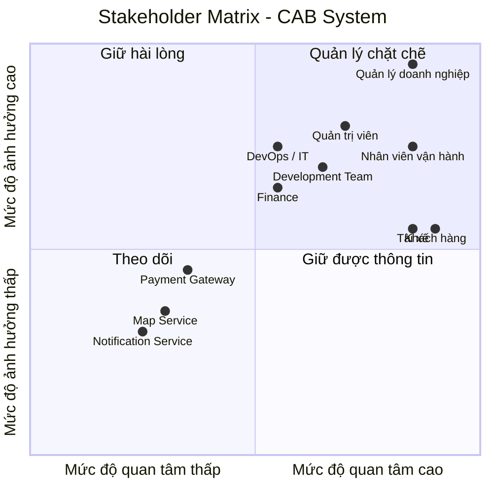
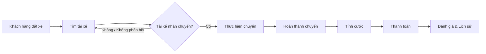

### Xây dựng hệ thống cơ bản

**Đóng vai trò:** BA (Business Analyst)

#### Bước 1: Phân tích yêu cầu của khách hàng

Ở giai đoạn sơ khởi (giai đoạn 1), BA cần tập trung vào việc **phân tích và tìm hiểu yêu cầu của khách hàng**.

Mục tiêu chính là hiểu được **Business Context** – tức là **ngữ cảnh của nghiệp vụ**, bao gồm:

- **Khách hàng là ai?**
- **Doanh nghiệp đang giải quyết vấn đề gì?**
- **Mục tiêu kinh doanh (Business Goal) là gì?**
- **Quy trình nghiệp vụ hiện tại (As-Is) đang diễn ra như thế nào?**
- **Những vấn đề hoặc khó khăn đang tồn tại là gì?**
- **Hệ thống cần giải quyết vấn đề nào?**
- **Kết quả mong muốn (To-Be) của khách hàng là gì?**
**Trả lời cho dự án CAB System:**

- **Khách hàng là ai?** Công ty ABC – doanh nghiệp cung cấp dịch vụ đặt xe trực tuyến.
- **Doanh nghiệp đang giải quyết vấn đề gì?** Hệ thống hiện tại (tổng đài + app đơn giản) còn nhiều hạn chế: phân công tài xế thủ công, khách hàng khó theo dõi trạng thái chuyến đi, thông tin thanh toán chưa quản lý tập trung, khó mở rộng hệ thống khi quy mô tăng.
- **Mục tiêu kinh doanh (Business Goal) là gì?** Xây dựng một nền tảng CAB mới có khả năng phục vụ số lượng lớn khách hàng và tài xế, đồng thời có thể phát triển thêm tính năng trong tương lai mà không cần xây lại toàn bộ hệ thống.
- **Quy trình nghiệp vụ hiện tại (As-Is) đang diễn ra như thế nào?** Khách hàng liên hệ tổng đài hoặc dùng app đơn giản để yêu cầu xe → nhân viên phân công tài xế thủ công → khách hàng khó nắm được trạng thái chuyến → thanh toán và dữ liệu chưa tập trung, khó theo dõi.
- **Những vấn đề hoặc khó khăn đang tồn tại là gì?**
  - Phân công tài xế thủ công, chậm, không tối ưu.
  - Thiếu minh bạch về trạng thái chuyến đi cho khách hàng.
  - Thanh toán phân mảnh, chưa tích hợp cổng thanh toán bên ngoài an toàn.
  - Khó mở rộng hạ tầng khi tải tăng cao (giờ cao điểm).
  - Thiếu công cụ quản trị & báo cáo cho vận hành.
  - Chưa có kiểm soát bảo mật, phân quyền và audit trail rõ ràng.
- **Hệ thống cần giải quyết vấn đề nào?** Tự động hóa việc tìm và phân công tài xế, tập trung hóa quản lý thanh toán, cung cấp khả năng theo dõi chuyến đi theo thời gian thực, đảm bảo hệ thống có thể mở rộng độc lập theo module (kiến trúc modular/microservices) và không bị sập toàn bộ khi một thành phần (thanh toán, thông báo) gặp lỗi.
- **Kết quả mong muốn (To-Be) của khách hàng là gì?** Một nền tảng CAB hoàn chỉnh, đáp ứng toàn bộ quy trình từ tạo yêu cầu → tìm/phân công tài xế → thực hiện chuyến → tính cước → thanh toán → thông báo → đánh giá sau chuyến, có khả năng mở rộng linh hoạt (thêm dịch vụ, phương thức thanh toán, kênh thông báo) và đảm bảo bảo mật, ổn định khi vận hành ở quy mô lớn.
  
## 2. Xác định các Stakeholders

### 2.1. Danh sách Stakeholders

| Tên Stakeholders | Vai trò |
|---|---|
| **Khách hàng (Customer)** | Người sử dụng hệ thống để đặt xe, theo dõi chuyến đi, thanh toán và đánh giá dịch vụ. |
| **Tài xế (Driver)** | Nhận yêu cầu chuyến xe, xác nhận chuyến, thực hiện chuyến và cập nhật trạng thái chuyến đi. |
| **Nhân viên vận hành (Operator)** | Theo dõi và điều phối hoạt động đặt xe, hỗ trợ xử lý các vấn đề phát sinh trong quá trình vận hành. |
| **Quản trị viên (Admin)** | Quản lý người dùng, tài xế, phân quyền, cấu hình hệ thống và theo dõi hoạt động của hệ thống. |
| **Quản lý doanh nghiệp (Business Manager)** | Định hướng mục tiêu kinh doanh, theo dõi hiệu quả hoạt động và đưa ra các quyết định liên quan đến hệ thống. |
| **Bộ phận kế toán / tài chính (Finance)** | Quản lý doanh thu, giao dịch, đối soát và các vấn đề liên quan đến thanh toán. |
| **Đội ngũ phát triển (Development Team)** | Phân tích, thiết kế, phát triển, tích hợp và bảo trì hệ thống. |
| **Đội ngũ vận hành hệ thống (DevOps / IT Operations)** | Triển khai, giám sát, đảm bảo tính ổn định, khả năng mở rộng và xử lý sự cố hệ thống. |
| **Cổng thanh toán (Payment Gateway)** | Cung cấp dịch vụ xử lý và xác nhận các giao dịch thanh toán. |
| **Dịch vụ bản đồ / định vị (Map & Location Service)** | Cung cấp dữ liệu bản đồ, vị trí, khoảng cách và hỗ trợ tính toán lộ trình. |
| **Dịch vụ thông báo (Notification Service)** | Gửi thông báo đến khách hàng và tài xế thông qua các kênh như SMS, Email hoặc Push Notification. |

### 2.2. Stakeholder Matrix

Stakeholder Matrix giúp xác định **mức độ ảnh hưởng (Power)** và **mức độ quan tâm (Interest)** của từng stakeholder đối với hệ thống.

**Diễn giải 4 nhóm trong ma trận:**

- **Quản lý chặt chẽ (High Power – High Interest):** Ban lãnh đạo, BA → cần giao tiếp thường xuyên, tham gia sâu vào các quyết định.
- **Giữ hài lòng (High Power – Low Interest):** Nhân viên vận hành, Bộ phận bảo mật → cần được thông báo và đảm bảo yêu cầu của họ được đáp ứng dù không tham gia hàng ngày.
- **Giữ thông tin đầy đủ (Low Power – High Interest):** Khách hàng, Tài xế, Đội phát triển → quan tâm trực tiếp đến kết quả, cần được cập nhật thông tin thường xuyên nhưng không có quyền quyết định phạm vi dự án.
- **Giám sát tối thiểu (Low Power – Low Interest):** Nhà cung cấp thanh toán bên ngoài → chỉ cần phối hợp ở mức tích hợp kỹ thuật, không cần tham gia sâu vào quá trình phân tích.
.....

#### Bước 3: Xác định Mục tiêu nghiệp vụ (Business Goals)

Từ Business Context và Business Purpose đã phân tích ở Bước 1, BA xác định các mục tiêu nghiệp vụ cụ thể mà hệ thống CAB cần đạt được:

| Mã | Mục tiêu nghiệp vụ (Business Goal) |
|---|---|
| BG01 | Tự động tìm và phân công tài xế phù hợp cho khách hàng |
| BG02 | Hỗ trợ thanh toán (cho phép thanh toán tiền mặt và thanh toán điện tử) |
| BG03 | Cung cấp khả năng theo dõi chuyến đi theo thời gian thực cho khách hàng |
| BG04 | Gửi thông báo tự động cho khách hàng và tài xế xuyên suốt vòng đời chuyến đi |
| BG05 | Cung cấp công cụ quản trị và báo cáo cho nhân viên vận hành |
| BG06 | Đảm bảo hệ thống có khả năng mở rộng (scalable) và hoạt động ổn định khi tải tăng cao |
| BG07 | Bảo vệ dữ liệu và kiểm soát truy cập theo đúng yêu cầu bảo mật |
| BG08 | Xây dựng kiến trúc linh hoạt, dễ mở rộng để bổ sung dịch vụ, phương thức thanh toán, kênh thông báo mới trong tương lai |
| BG09 | Nâng cao chất lượng dịch vụ thông qua cơ chế đánh giá tài xế sau chuyến đi |

**Diễn giải chi tiết:**

- **BG01 – Tự động tìm tài xế:** Khi khách hàng tạo chuyến, hệ thống tự động xác định tài xế phù hợp dựa trên vị trí, trạng thái sẵn sàng và tiêu chí vận hành, có cơ chế tìm tài xế khác nếu tài xế đầu tiên không phản hồi/từ chối, không yêu cầu khách hàng tạo lại yêu cầu.
- **BG02 – Hỗ trợ thanh toán:** Cho phép thanh toán tiền mặt và thanh toán điện tử qua nhà cung cấp thanh toán bên ngoài, không lưu trực tiếp thông tin nhạy cảm của thẻ/tài khoản trong hệ thống CAB, có cơ chế xử lý khi giao dịch điện tử thất bại.
- **BG03 – Theo dõi chuyến đi thời gian thực:** Khách hàng biết được trạng thái tìm tài xế, tài xế nhận chuyến, thời gian dự kiến đến và trạng thái hiện tại của chuyến đi.
- **BG04 – Thông báo:** Khách hàng nhận thông báo khi yêu cầu được tiếp nhận, tài xế nhận chuyến, tài xế đến điểm đón, chuyến hoàn thành, kết quả thanh toán; tài xế nhận thông báo về chuyến mới hoặc thay đổi liên quan.
- **BG05 – Công cụ quản trị & báo cáo:** Nhân viên vận hành quản lý khách hàng, tài xế, phương tiện, chuyến đi; xem báo cáo số lượng chuyến, doanh thu, tỷ lệ hoàn thành/hủy, hiệu quả hoạt động tài xế.
- **BG06 – Khả năng mở rộng & ổn định:** Các thành phần hệ thống scale độc lập khi tải tăng; lỗi ở một chức năng (thanh toán, thông báo) không làm sập toàn bộ hệ thống.
- **BG07 – Bảo mật:** Xác thực khách hàng/tài xế trước khi dùng chức năng yêu cầu tài khoản, kiểm soát quyền truy cập cho thao tác quản trị, bảo vệ dữ liệu cá nhân/vị trí/giao dịch, lưu vết (audit log) các thao tác quan trọng.
- **BG08 – Kiến trúc linh hoạt:** Cho phép bổ sung loại dịch vụ mới, phương thức thanh toán mới, nhà cung cấp thông báo mới hoặc thay đổi thành phần kỹ thuật mà không cần xây lại toàn bộ ứng dụng.
- **BG09 – Đánh giá tài xế:** Sau khi hoàn thành chuyến, khách hàng có thể đánh giá tài xế; dữ liệu đánh giá được dùng để cải thiện chất lượng dịch vụ và làm tiêu chí tham khảo trong hoạt động vận hành (ví dụ: theo dõi hiệu quả tài xế trong báo cáo — liên quan BG05).

# 4. Xác định phạm vi yêu cầu của mình phải làm(Scope) 
# - VD: Quản lý khách hàng, Quản lý tài xế,...
# - Trong bảng MVP phải làm cái gì - Xác định được các module cơ bản dưới góc độ 1 bảng MVP 
# - Mở rộng: Những cái mà ngoài phạm vi tôi không phải làm/Không nên làm trong đây

## 4.1. In Scope – Phạm vi hệ thống

Dựa trên yêu cầu của khách hàng, phạm vi của CAB System bao gồm các module nghiệp vụ chính sau:

| ID      | Module                           | Phạm vi chính                                                                                                                                           |
| ------- | -------------------------------- | ------------------------------------------------------------------------------------------------------------------------------------------------------- |
| **M01** | **Quản lý tài khoản & xác thực** | Đăng ký, đăng nhập, xác thực khách hàng và tài xế, cập nhật thông tin cá nhân và kiểm soát quyền truy cập.                                              |
| **M02** | **Quản lý tài xế & phương tiện** | Quản lý hồ sơ tài xế, thông tin phương tiện, trạng thái hoạt động và thông tin vị trí của tài xế.                                                       |
| **M03** | **Đặt xe**                       | Nhập điểm đón, điểm đến, lựa chọn loại xe và tạo yêu cầu đặt xe.                                                                                        |
| **M04** | **Tìm kiếm & phân công tài xế**  | Xác định tài xế phù hợp, ưu tiên tài xế gần khách hàng, gửi yêu cầu nhận chuyến và xử lý trường hợp tài xế từ chối hoặc không phản hồi.                 |
| **M05** | **Quản lý chuyến đi**            | Theo dõi và cập nhật các trạng thái của chuyến: tìm tài xế, tài xế nhận chuyến, tài xế đến điểm đón, đã đón khách, đang di chuyển và hoàn thành chuyến. |
| **M06** | **Tính cước & thanh toán**       | Tính số tiền phải trả, hỗ trợ thanh toán tiền mặt và thanh toán điện tử thông qua Payment Provider, xử lý kết quả giao dịch và thanh toán thất bại.     |
| **M07** | **Thông báo**                    | Gửi thông báo cho khách hàng và tài xế về các sự kiện liên quan đến đặt xe, tài xế, chuyến đi và thanh toán.                                            |
| **M08** | **Lịch sử & đánh giá**           | Xem lịch sử chuyến đi, số tiền phải trả và đánh giá tài xế sau khi hoàn thành chuyến.                                                                   |
| **M09** | **Quản trị & vận hành**          | Quản lý khách hàng, tài xế, phương tiện và chuyến đi; theo dõi chuyến đang diễn ra, trạng thái tài xế và hỗ trợ xử lý sự cố.                            |
| **M10** | **Báo cáo**                      | Cung cấp báo cáo về số lượng chuyến, doanh thu, tỷ lệ hoàn thành, tỷ lệ hủy và hiệu quả hoạt động của tài xế.                                           |
| **M11** | **Bảo mật & Audit Log**          | Xác thực, phân quyền các thao tác quản trị, bảo vệ dữ liệu cá nhân, phương tiện, vị trí và giao dịch; lưu vết các thao tác quan trọng.                  |
| **M12** | **Tích hợp hệ thống bên ngoài**  | Tích hợp với nhà cung cấp thanh toán và nhà cung cấp dịch vụ thông báo.                                                                                 |

---

## 4.2. MVP – Minimum Viable Product

Do thời gian xây dựng và triển khai sản phẩm chỉ **7 tuần**, MVP tập trung vào quy trình nghiệp vụ cốt lõi từ **đặt xe → tìm tài xế → thực hiện chuyến → tính cước → thanh toán**.

| Priority        | Module                              | MVP cần thực hiện                                                                          |
| --------------- | ----------------------------------- | ------------------------------------------------------------------------------------------ |
| **Must Have**   | **M01 – Tài khoản & xác thực**      | Đăng ký, đăng nhập và xác thực khách hàng/tài xế.                                          |
| **Must Have**   | **M02 – Tài xế & phương tiện**      | Quản lý hồ sơ, phương tiện và trạng thái sẵn sàng của tài xế.                              |
| **Must Have**   | **M03 – Đặt xe**                    | Nhập điểm đón, điểm đến, chọn loại xe và gửi yêu cầu đặt xe.                               |
| **Must Have**   | **M04 – Tìm & phân công tài xế**    | Tìm tài xế phù hợp, gửi yêu cầu, xử lý từ chối/không phản hồi và tiếp tục tìm tài xế khác. |
| **Must Have**   | **M05 – Quản lý chuyến**            | Cập nhật và theo dõi trạng thái chuyến từ lúc đặt xe đến khi hoàn thành.                   |
| **Must Have**   | **M06 – Tính cước & thanh toán**    | Tính cước, thanh toán tiền mặt và tích hợp thanh toán điện tử.                             |
| **Must Have**   | **M07 – Thông báo**                 | Các thông báo thiết yếu cho khách hàng và tài xế.                                          |
| **Must Have**   | **M09 – Quản trị & vận hành**       | Theo dõi chuyến, trạng thái tài xế và xử lý các trường hợp phát sinh cơ bản.               |
| **Must Have**   | **M11 – Bảo mật & Audit Log**       | Xác thực, phân quyền và bảo vệ dữ liệu quan trọng.                                         |
| **Should Have** | **M08 – Lịch sử & đánh giá**        | Xem lịch sử chuyến và đánh giá tài xế sau chuyến.                                          |
| **Should Have** | **M10 – Báo cáo**                   | Các báo cáo cơ bản về chuyến, doanh thu, hoàn thành và hủy chuyến.                         |
| **Should Have** | **M12 – Khả năng mở rộng tích hợp** | Thiết kế khả năng thay đổi/thêm Payment Provider và Notification Provider trong tương lai. |

### MVP Core Flow

---

## 4.3. Out of Scope – Ngoài phạm vi

Các chức năng sau **không được đề cập trong yêu cầu hiện tại** và không đưa vào phạm vi xây dựng MVP:

| ID      | Hạng mục                                                     | Lý do                                                                                        |
| ------- | ------------------------------------------------------------ | -------------------------------------------------------------------------------------------- |
| **O01** | Chương trình tích điểm / Loyalty                             | Không được đề cập trong yêu cầu khách hàng.                                                  |
| **O02** | Mã giảm giá / Voucher / Coupon                               | Không được đề cập trong yêu cầu hiện tại.                                                    |
| **O03** | Gói thành viên / Subscription                                | Không thuộc quy trình đặt xe được mô tả.                                                     |
| **O04** | Đặt xe định kỳ                                               | Không được đề cập trong yêu cầu.                                                             |
| **O05** | Dịch vụ giao hàng                                            | Chưa có yêu cầu về loại dịch vụ này.                                                         |
| **O06** | Quảng cáo hoặc bán dịch vụ bên thứ ba                        | Không thuộc mục tiêu của dự án.                                                              |
| **O07** | Hệ thống thưởng/phạt tài xế nâng cao                         | Transcript chỉ yêu cầu quản lý và đánh giá hiệu quả tài xế, chưa yêu cầu cơ chế thưởng/phạt. |
| **O08** | Phân tích dữ liệu nâng cao / AI dự đoán                      | Không được yêu cầu trong phạm vi hiện tại.                                                   |
| **O09** | Ứng dụng riêng cho bộ phận quản trị ngoài giao diện quản trị | Chưa có yêu cầu xây dựng ứng dụng riêng; hệ thống chỉ yêu cầu giao diện quản trị.            |

---

## 4.4. Future Scope – Khả năng mở rộng trong tương lai

Hệ thống được định hướng có khả năng mở rộng, do đó các hạng mục sau có thể được xem xét ở các giai đoạn tiếp theo:

* Bổ sung các loại dịch vụ/loại hình đặt xe mới.
* Bổ sung các phương thức thanh toán mới.
* Bổ sung nhà cung cấp thanh toán hoặc thông báo.
* Mở rộng các kênh thông báo.
* Mở rộng chức năng báo cáo và phân tích.
* Bổ sung các chức năng nghiệp vụ mới theo nhu cầu kinh doanh.
* Thay đổi hoặc nâng cấp các thành phần kỹ thuật mà hạn chế ảnh hưởng đến các chức năng đang hoạt động.

# 5: Xác nhận với khách hàng & Chuyển thành Business Requirement (BR)

**Dự án:** CAB System – Nền tảng đặt xe
**Vai trò:** Business Analyst (BA)

---

## 1. Mục đích bước này

Sau khi hoàn thành **Bước 4** (thu thập & đặc tả yêu cầu chức năng/phi chức năng chi tiết, làm rõ các điểm còn mơ hồ với stakeholder), BA cần:

1. Tổ chức buổi họp xác nhận lại với khách hàng để đảm bảo hiểu đúng yêu cầu.
2. Sau khi khách hàng xác nhận, chuyển hóa các yêu cầu đó thành **Business Requirement (BR)** — mô tả *doanh nghiệp cần gì* (ở mức nghiệp vụ), làm nền tảng để sau này BA tiếp tục phân rã thành Functional Requirement (FR) chi tiết hơn.

Mỗi BR được đặt mã theo quy tắc: **BR + số thứ tự 2 chữ số** (BR01, BR02, BR03...).

---

## 2. Danh sách Business Requirement (BR)

| Mã | Tên | Diễn giải |
|---|---|---|
| **BR01** | Đặt chuyến | Khách hàng có thể tạo yêu cầu đặt xe bằng cách nhập điểm đón, điểm đến và chọn loại xe; hệ thống tiếp nhận và bắt đầu quy trình tìm tài xế. |
| **BR02** | Quản lý tài khoản khách hàng | Khách hàng có thể đăng ký, đăng nhập và cập nhật thông tin cá nhân để sử dụng dịch vụ. |
| **BR03** | Quản lý tài khoản & hồ sơ tài xế | Tài xế được đăng ký (tự đăng ký hoặc do nhân viên vận hành tạo) và có thể cập nhật hồ sơ, thông tin phương tiện, trạng thái hoạt động. |
| **BR04** | Tìm kiếm & phân công tài xế | Hệ thống tự động xác định và đề xuất tài xế phù hợp cho một chuyến đi, dựa trên vị trí, trạng thái sẵn sàng và tiêu chí vận hành. |
| **BR05** | Xử lý từ chối/không phản hồi của tài xế | Khi tài xế được đề xuất không nhận chuyến, hệ thống tự động tìm tài xế khác mà không yêu cầu khách hàng tạo lại yêu cầu; nếu không tìm được, khách hàng phải được thông báo rõ ràng. |
| **BR06** | Theo dõi trạng thái chuyến đi | Khách hàng và tài xế có thể theo dõi/cập nhật trạng thái chuyến đi theo thời gian thực (đang tìm tài xế, đã nhận chuyến, đã đến điểm đón, đang di chuyển, hoàn thành...). |
| **BR07** | Cập nhật vị trí tài xế | Hệ thống lưu và cập nhật vị trí tài xế để hỗ trợ việc tìm tài xế gần khách hàng và ước tính thời gian đến. |
| **BR08** | Tính cước chuyến đi | Sau khi chuyến đi hoàn thành, hệ thống tự động xác định số tiền khách hàng phải trả dựa trên loại dịch vụ và thông tin chuyến đi. |
| **BR09** | Thanh toán | Khách hàng có thể thanh toán bằng tiền mặt hoặc phương thức điện tử; hệ thống tích hợp với nhà cung cấp thanh toán bên ngoài mà không lưu trực tiếp thông tin nhạy cảm của thẻ/tài khoản. |
| **BR10** | Xử lý lỗi thanh toán | Khi giao dịch thanh toán điện tử thất bại, hệ thống thông báo cho khách hàng và cho phép xử lý lại theo chính sách doanh nghiệp. |
| **BR11** | Lịch sử chuyến & đánh giá tài xế | Khách hàng có thể xem lịch sử chuyến đi, số tiền đã trả và đánh giá tài xế sau khi hoàn thành chuyến. |
| **BR12** | Thông báo cho khách hàng | Khách hàng nhận thông báo tại các mốc quan trọng: yêu cầu được tiếp nhận, tài xế nhận chuyến, tài xế đến điểm đón, chuyến hoàn thành, kết quả thanh toán. |
| **BR13** | Thông báo cho tài xế | Tài xế nhận thông báo về chuyến mới hoặc thay đổi liên quan đến chuyến đang thực hiện. |
| **BR14** | Quản trị vận hành | Nhân viên vận hành có giao diện quản trị để quản lý khách hàng, tài xế, phương tiện và chuyến đi, bao gồm xử lý các chuyến bị lỗi và tra cứu lịch sử giao dịch. |
| **BR15** | Phân quyền thao tác quản trị | Các thao tác quản trị nhạy cảm phải được phân quyền, nhân viên thông thường không thể thực hiện. |
| **BR16** | Báo cáo & thống kê vận hành | Ban lãnh đạo có báo cáo về số lượng chuyến, doanh thu, tỷ lệ chuyến hoàn thành, tỷ lệ hủy và hiệu quả hoạt động của tài xế. |
| **BR17** | Xác thực người dùng | Khách hàng và tài xế phải được xác thực trước khi sử dụng các chức năng yêu cầu tài khoản. |
| **BR18** | Bảo vệ dữ liệu | Thông tin cá nhân, thông tin phương tiện, dữ liệu vị trí và dữ liệu giao dịch phải được bảo vệ. |
| **BR19** | Lưu vết thao tác (Audit log) | Hệ thống lưu vết các thao tác quan trọng để phục vụ kiểm tra khi có sự cố. |
| **BR20** | Vận hành ổn định & chịu lỗi cục bộ | Hệ thống phải hoạt động ổn định vào thời điểm nhu cầu cao; lỗi ở một chức năng (thanh toán, thông báo...) không được làm ngừng toàn bộ hệ thống đặt xe. |
| **BR21** | Kiến trúc mở rộng linh hoạt | Hệ thống phải có khả năng mở rộng độc lập theo tải, triển khai từng phần và bổ sung dịch vụ mới, phương thức thanh toán mới, kênh thông báo mới mà không cần xây dựng lại toàn bộ. |

---
# 6: Xây dựng Business Process (Quy trình nghiệp vụ)

Từ danh sách Business Requirements (BR01–BR37) đã xác nhận với khách hàng ở Bước 5, tiến hành mô hình hóa thành các **Business Process (BP)** — mô tả luồng thực hiện từng bước, bao gồm cả **luồng chính (Main Flow)**, **luồng phụ (Alternative Flow)** và **luồng ngoại lệ (Exception Flow)**. Mỗi BP là cơ sở để thiết kế Use Case chi tiết ở bước sau.

---

##### BP01 – Đặt chuyến (Booking Trip)

**Mục tiêu:** Khách hàng tạo yêu cầu đặt xe và được ghép với tài xế phù hợp.
**BR liên quan:** BR11, BR12, BR13, BR14, BR15, BR16

**Luồng chính (Main Flow):**
1. Khách hàng đăng nhập vào hệ thống.
2. Khách hàng nhập điểm đón và điểm đến.
3. Khách hàng chọn loại xe/dịch vụ.
4. Khách hàng xác nhận gửi yêu cầu đặt xe.
5. Hệ thống tiếp nhận yêu cầu và gửi thông báo xác nhận cho khách hàng.
6. Hệ thống tìm kiếm tài xế phù hợp dựa trên vị trí và trạng thái sẵn sàng (→ BP02).
7. Tài xế chấp nhận chuyến.
8. Hệ thống thông báo cho khách hàng: tài xế đã nhận chuyến, thông tin tài xế, thời gian dự kiến đến.
9. Chuyến đi chuyển sang trạng thái "đang chờ tài xế đến điểm đón" (→ BP03).

**Luồng phụ (Alternative Flow):**
- 7a. Tài xế từ chối hoặc không phản hồi trong thời gian quy định → hệ thống tự động tìm tài xế kế tiếp (lặp lại bước 6–7), khách hàng **không cần** tạo lại yêu cầu.

**Luồng ngoại lệ (Exception Flow):**
- 6a. Không tìm được tài xế phù hợp sau nhiều lần thử → hệ thống thông báo rõ cho khách hàng là không tìm được tài xế, kết thúc quy trình.
- 4a. Khách hàng hủy yêu cầu trước khi có tài xế nhận → hệ thống hủy yêu cầu, không phát sinh chi phí.

---

##### BP02 – Điều phối & Tìm tài xế (Dispatch/Matching)

**Mục tiêu:** Ghép tài xế phù hợp nhất cho một yêu cầu đặt xe.
**BR liên quan:** BR12, BR13, BR14, BR15

**Luồng chính:**
1. Hệ thống nhận yêu cầu đặt xe từ BP01.
2. Hệ thống xác định danh sách tài xế đang ở trạng thái sẵn sàng, gần vị trí khách hàng.
3. Hệ thống chọn tài xế phù hợp nhất theo tiêu chí ưu tiên (khoảng cách, trạng thái...).
4. Hệ thống gửi thông báo đề xuất chuyến đến tài xế được chọn.
5. Tài xế phản hồi (chấp nhận/từ chối) trong thời gian quy định.
6. Nếu chấp nhận → hệ thống cập nhật trạng thái chuyến là "đã có tài xế", kết thúc quy trình, quay lại BP01 bước 8.

**Luồng phụ:**
- 5a. Tài xế từ chối → hệ thống loại tài xế này khỏi danh sách đề xuất cho chuyến hiện tại, quay lại bước 3 với tài xế kế tiếp.
- 5b. Tài xế không phản hồi trong thời gian quy định (timeout) → hệ thống tự động loại và quay lại bước 3.

**Luồng ngoại lệ:**
- 2a. Không còn tài xế nào sẵn sàng trong khu vực → chuyển sang BP01 – Exception (thông báo không tìm được tài xế).

---

##### BP03 – Thực hiện chuyến đi (Trip Execution)

**Mục tiêu:** Theo dõi và cập nhật hành trình chuyến đi từ khi tài xế nhận cho đến khi hoàn thành.
**BR liên quan:** BR16, BR17

**Luồng chính:**
1. Tài xế di chuyển đến điểm đón.
2. Tài xế cập nhật trạng thái "đã đến điểm đón".
3. Hệ thống thông báo cho khách hàng tài xế đã đến.
4. Tài xế cập nhật trạng thái "đã đón khách".
5. Tài xế cập nhật trạng thái "đang di chuyển".
6. Khách hàng theo dõi hành trình theo thời gian thực trong suốt chuyến đi.
7. Tài xế đến điểm trả khách, cập nhật trạng thái "hoàn thành chuyến".
8. Hệ thống chuyển sang quy trình tính cước và thanh toán (→ BP04).

**Luồng phụ:**
- 1a. Khách hàng hủy chuyến sau khi đã có tài xế nhưng trước khi tài xế đến điểm đón → hệ thống cập nhật trạng thái "đã hủy", giải phóng tài xế về trạng thái sẵn sàng (chính sách phí hủy: cần làm rõ thêm với khách hàng — xem Open Questions).

**Luồng ngoại lệ:**
- 4a. Khách hàng không có mặt tại điểm đón → cần quy trình xử lý riêng (chính sách chưa chốt — Open Question), tạm thời chuyển cho nhân viên vận hành xử lý thủ công (→ BP08).
- 5a. Mất kết nối giữa app tài xế và hệ thống trong khi di chuyển → cần cơ chế đồng bộ lại trạng thái khi có kết nối trở lại (chi tiết kỹ thuật xử lý mất kết nối chưa chốt — Open Question).

---

##### BP04 – Tính cước & Thanh toán (Fare & Payment)

**Mục tiêu:** Xác định số tiền khách hàng phải trả và xử lý thanh toán sau khi hoàn thành chuyến.
**BR liên quan:** BR18, BR19, BR20, BR21, BR22

**Luồng chính:**
1. Hệ thống nhận sự kiện "chuyến hoàn thành" từ BP03.
2. Hệ thống tính cước dựa trên loại dịch vụ và thông tin chuyến đi.
3. Hệ thống hiển thị số tiền cần thanh toán cho khách hàng.
4. Khách hàng chọn hình thức thanh toán: tiền mặt hoặc điện tử.

**Nhánh 4a – Thanh toán tiền mặt:**
- 4a.1. Khách hàng trả tiền mặt trực tiếp cho tài xế.
- 4a.2. Tài xế xác nhận đã nhận tiền trên hệ thống.
- 4a.3. Hệ thống cập nhật trạng thái thanh toán "hoàn tất".
**Nhánh 4b – Thanh toán điện tử:**
- 4b.1. Hệ thống gửi yêu cầu thanh toán đến nhà cung cấp thanh toán bên ngoài (không gửi kèm thông tin nhạy cảm của thẻ/tài khoản đến hệ thống CAB).
- 4b.2. Nhà cung cấp thanh toán xử lý và trả kết quả về hệ thống.
- 4b.3. Hệ thống cập nhật trạng thái thanh toán "hoàn tất" và thông báo kết quả cho khách hàng (→ BP05).

**Luồng ngoại lệ:**
- 4b.2a. Giao dịch thanh toán điện tử thất bại → hệ thống thông báo cho khách hàng, cho phép chọn lại phương thức thanh toán hoặc thử lại theo chính sách của doanh nghiệp (chi tiết chính sách retry chưa chốt — Open Question).

---

##### BP05 – Thông báo (Notification)

**Mục tiêu:** Đảm bảo khách hàng và tài xế được cập nhật thông tin kịp thời tại các mốc quan trọng.
**BR liên quan:** BR23, BR24

**Luồng chính (chạy song song/độc lập với các BP khác, được kích hoạt bởi sự kiện):**
1. Hệ thống lắng nghe các sự kiện phát sinh từ các quy trình khác: tiếp nhận yêu cầu (BP01), tài xế nhận chuyến (BP02), tài xế đến điểm đón / hoàn thành chuyến (BP03), kết quả thanh toán (BP04).
2. Khi có sự kiện phát sinh, hệ thống xác định đối tượng cần nhận thông báo (khách hàng và/hoặc tài xế).
3. Hệ thống gửi thông báo qua kênh tương ứng (ví dụ: push notification/app).
4. Ghi nhận trạng thái gửi thông báo (thành công/thất bại).

**Luồng ngoại lệ:**
- 3a. Gửi thông báo thất bại → hệ thống ghi log lỗi, có thể thử gửi lại theo chính sách (không được ảnh hưởng đến các chức năng đặt xe/thanh toán khác — theo BR36).

---

##### BP06 – Đánh giá tài xế (Rating)

**Mục tiêu:** Thu thập phản hồi của khách hàng sau chuyến đi.
**BR liên quan:** BR25

**Luồng chính:**
1. Sau khi thanh toán hoàn tất (BP04), hệ thống hiển thị màn hình đánh giá cho khách hàng.
2. Khách hàng chọn mức đánh giá (ví dụ số sao) và có thể để lại nhận xét.
3. Khách hàng xác nhận gửi đánh giá.
4. Hệ thống lưu đánh giá, cập nhật điểm trung bình của tài xế.

**Luồng phụ:**
- 2a. Khách hàng bỏ qua bước đánh giá → hệ thống không ghi nhận đánh giá cho chuyến này, kết thúc quy trình.

---

##### BP07 – Đăng ký & Xác thực tài khoản (Registration & Authentication)

**Mục tiêu:** Cho phép khách hàng/tài xế tạo tài khoản và đăng nhập an toàn vào hệ thống.
**BR liên quan:** BR01, BR02, BR03, BR04

**Luồng chính:**
1. Người dùng (khách hàng/tài xế) chọn chức năng đăng ký.
2. Người dùng nhập thông tin cá nhân bắt buộc.
3. Hệ thống xác thực thông tin (ví dụ số điện thoại/email) hợp lệ.
4. Hệ thống tạo tài khoản mới.
5. Người dùng đăng nhập bằng tài khoản vừa tạo.
6. Hệ thống xác thực và cấp quyền truy cập tương ứng với vai trò (khách hàng/tài xế/nhân viên vận hành).

**Luồng phụ:**
- 2a. Đối với tài xế: nhân viên vận hành có thể tạo tài khoản thay tài xế (không qua bước tự đăng ký).

**Luồng ngoại lệ:**
- 3a. Thông tin không hợp lệ hoặc đã tồn tại → hệ thống thông báo lỗi, yêu cầu người dùng nhập lại.
- 6a. Sai thông tin đăng nhập → hệ thống từ chối truy cập và thông báo lỗi.

---

##### BP08 – Quản trị & Xử lý sự cố chuyến đi (Admin Operations)

**Mục tiêu:** Hỗ trợ nhân viên vận hành giám sát và xử lý các chuyến đi gặp vấn đề.
**BR liên quan:** BR26, BR27, BR28, BR29, BR30, BR35

**Luồng chính:**
1. Nhân viên vận hành đăng nhập vào giao diện quản trị.
2. Nhân viên xem danh sách các chuyến đang diễn ra và trạng thái tương ứng.
3. Nhân viên phát hiện hoặc được báo cáo một chuyến gặp sự cố (ví dụ khách không có mặt, tài xế mất kết nối...).
4. Nhân viên tra cứu thông tin chi tiết chuyến, khách hàng, tài xế liên quan.
5. Nhân viên thực hiện thao tác xử lý phù hợp (ví dụ: hủy chuyến, ghép lại tài xế, ghi chú sự cố).
6. Hệ thống ghi log thao tác xử lý (audit log).

**Luồng ngoại lệ:**
- 5a. Thao tác thuộc nhóm nhạy cảm (ví dụ hoàn tiền, khóa tài khoản) → hệ thống kiểm tra quyền hạn; nếu nhân viên không đủ quyền, từ chối thao tác và yêu cầu chuyển cấp quản trị cao hơn (theo BR04).

---

##### BP09 – Báo cáo vận hành (Reporting)

**Mục tiêu:** Cung cấp số liệu tổng hợp phục vụ ra quyết định quản lý.
**BR liên quan:** BR31, BR32, BR33

**Luồng chính:**
1. Nhân viên vận hành/quản lý chọn loại báo cáo cần xem (số lượng chuyến & doanh thu, tỷ lệ hoàn thành/hủy, hiệu quả tài xế).
2. Nhân viên chọn khoảng thời gian cần thống kê.
3. Hệ thống tổng hợp dữ liệu từ các chuyến đi, thanh toán, đánh giá tương ứng trong khoảng thời gian đã chọn.
4. Hệ thống hiển thị báo cáo dưới dạng bảng/biểu đồ.

**Luồng ngoại lệ:**
- 3a. Không có dữ liệu trong khoảng thời gian được chọn → hệ thống hiển thị thông báo "không có dữ liệu", không báo lỗi hệ thống.

---

##### Ghi chú tổng hợp

- Toàn bộ 9 Business Process (BP01–BP09) trên bao phủ đầy đủ các nhóm BR đã liệt kê ở Bước 5, tương ứng với các module đã xác định ở Bước 4.
- Các bước có đánh dấu **"chưa chốt" / "Open Question"** (ví dụ: chính sách hủy chuyến, xử lý khách không có mặt, xử lý mất kết nối mạng, chính sách retry thanh toán) cần được BA làm rõ với khách hàng **trước khi chuyển sang thiết kế Use Case chi tiết và đặc tả chức năng (Bước 7)**.
- Các BP được thiết kế tuân theo nguyên tắc **tách rời và không phụ thuộc chặt (loose coupling)** giữa các phân hệ (ví dụ: lỗi ở BP05 - Thông báo không được làm gián đoạn BP01 - Đặt chuyến), đúng theo yêu cầu BG06/BR36 về khả năng vận hành ổn định.

- Bảng trên là **Business Requirement** (mức nghiệp vụ – "cần cái gì, để làm gì"), **chưa** đi vào chi tiết kỹ thuật hay luồng xử lý (đó là việc của Functional Requirement / Use Case ở bước sau).
- Các BR liên quan đến điểm còn chưa rõ (cách tính cước – BR08, tiêu chí ưu tiên tài xế – BR04, chính sách hủy chuyến chưa có BR riêng, thời gian phản hồi của tài xế – liên quan BR05) **cần được khách hàng xác nhận chi tiết cụ thể** trong buổi họp xác nhận trước khi chốt.
- Sau khi khách hàng ký xác nhận bảng BR này, bước tiếp theo là phân rã từng BR thành các **Functional Requirement (FR)** và **Use Case** chi tiết.
